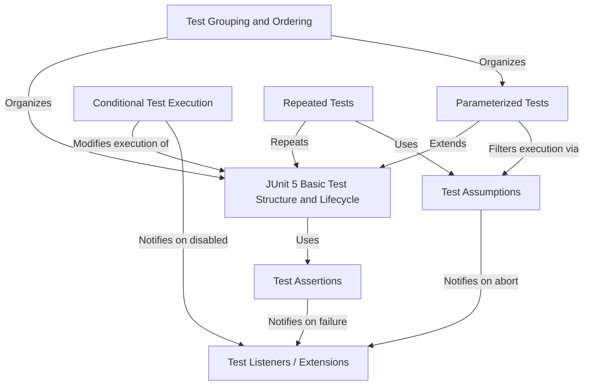
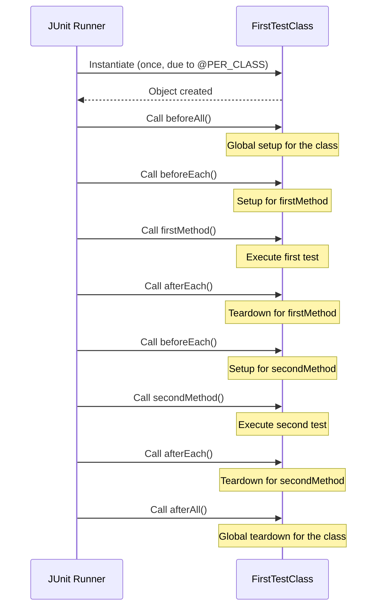
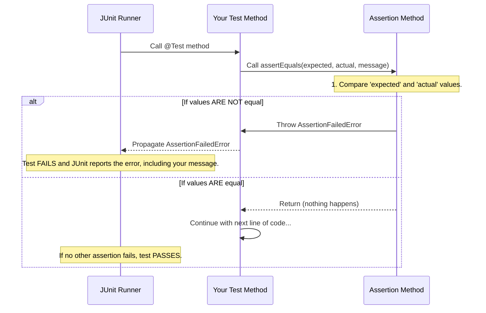
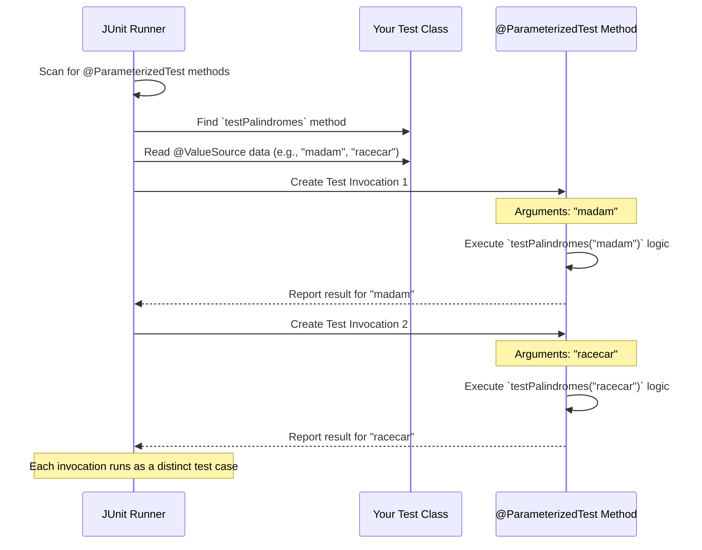
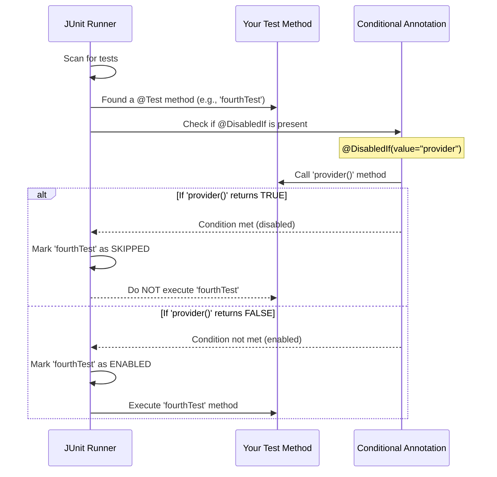
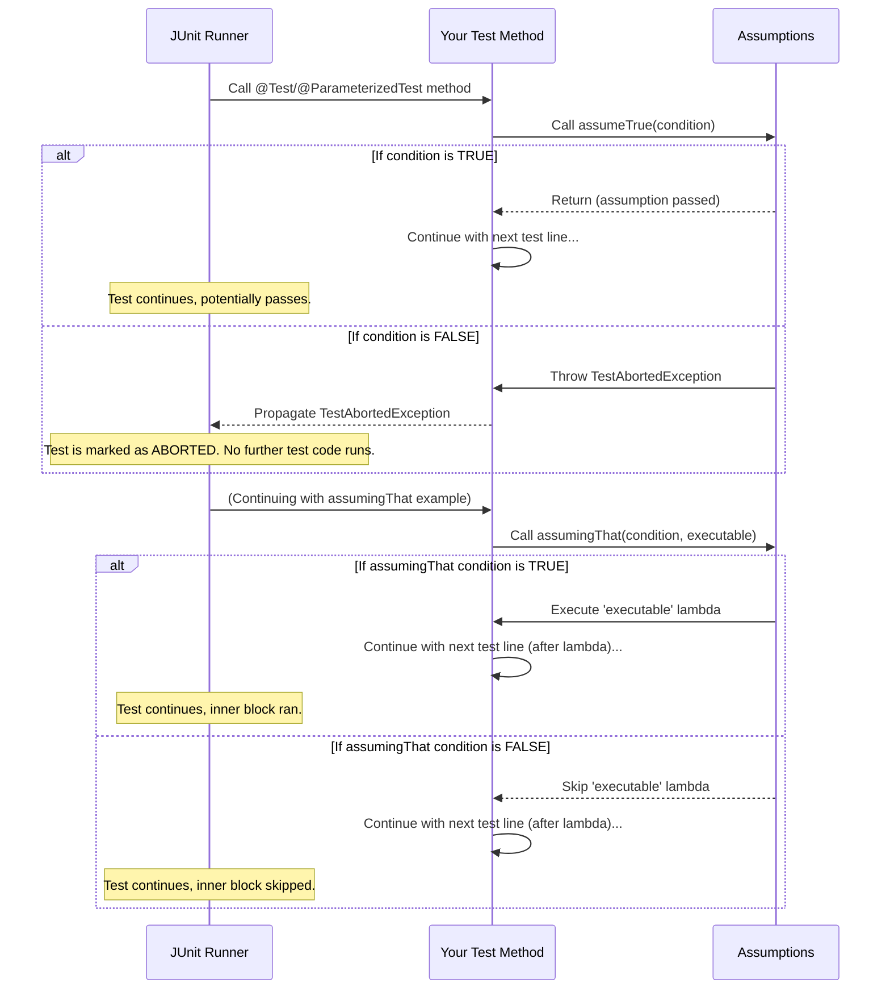
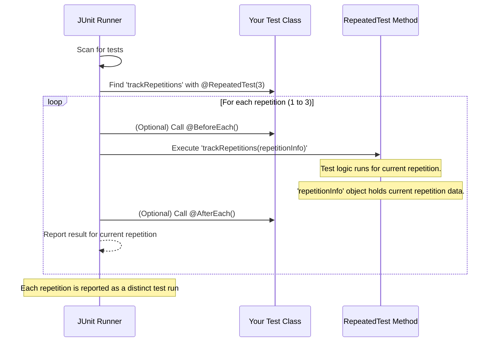
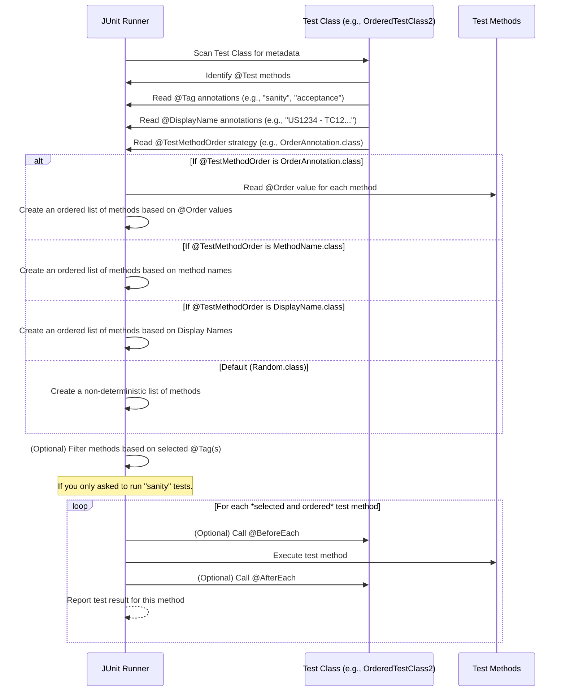
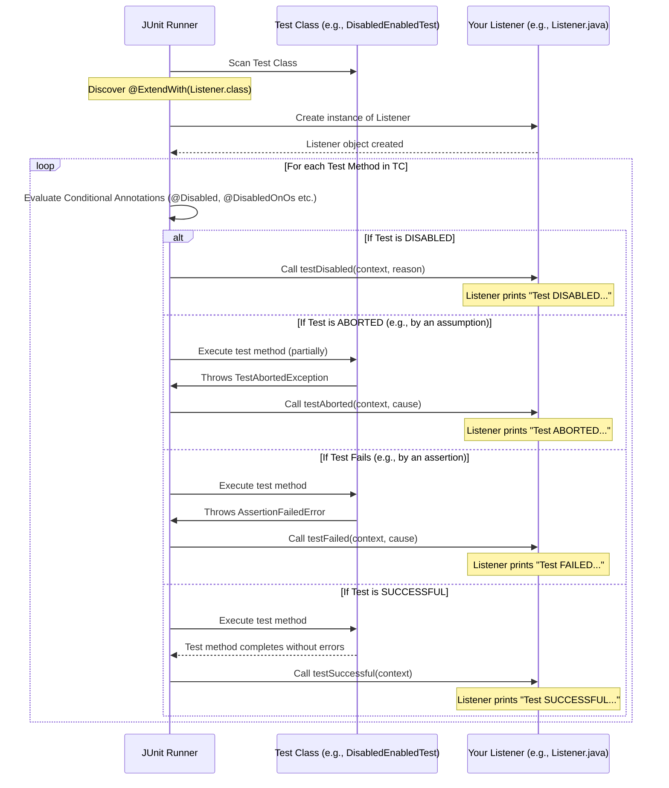

# Tutorial: junit5-tutorial

This `junit5-tutorial` project serves as a comprehensive guide to **JUnit 5**, showcasing its diverse features for *effective unit testing* in Java. It covers fundamental aspects like writing **basic tests** and managing their lifecycle, alongside advanced techniques such as running **parameterized tests** with various data sources, controlling test execution through **conditional logic**, and extending JUnit's behavior using **listeners**. The examples also demonstrate how to *verify code correctness* with powerful **assertions**, organize tests using **tags** and **ordering**, and manage test execution flow with **repetitions** and **assumptions**.


## Visual Overview



## Chapters

1. [JUnit 5 Basic Test Structure and Lifecycle
](01_junit_5_basic_test_structure_and_lifecycle_.md)
2. [Test Assertions
](02_test_assertions_.md)
3. [Parameterized Tests
](03_parameterized_tests_.md)
4. [Conditional Test Execution
](04_conditional_test_execution_.md)
5. [Test Assumptions
](05_test_assumptions_.md)
6. [Repeated Tests
](06_repeated_tests_.md)
7. [Test Grouping and Ordering
](07_test_grouping_and_ordering_.md)
8. [Test Listeners / Extensions
](08_test_listeners___extensions_.md)

---

# Chapter 1: JUnit 5 Basic Test Structure and Lifecycle

Welcome to the world of JUnit 5! This chapter will introduce you to the fundamental building blocks of writing tests with JUnit 5. Think of it like learning the basic ingredients and steps for a recipe.

## What is a Test Structure and Why Do We Need It?

When you write software, you want to make sure it works as expected. This is where "testing" comes in. Instead of manually checking everything, you can write small pieces of code (called "tests") that automatically verify if your main code is doing its job.

But simply writing code isn't enough; you need a way to organize these tests. Imagine you're testing a simple online shop application. Before you can test if "adding an item to the cart" works, you might need to:

1.  **Start the shopping application:** This needs to happen only *once* for all your tests.
2.  **Log in as a user:** You might need to log in *before each* individual test (e.g., before testing "add to cart", "remove from cart", "checkout").
3.  **Perform the actual action (the test):** Like clicking "add to cart".
4.  **Verify the result:** Check if the item is actually in the cart.
5.  **Clean up user data:** Maybe clear the cart or log out *after each* test so the next test starts fresh.
6.  **Shut down the shopping application:** This needs to happen only *once* after *all* your tests are done.

JUnit 5 provides a clear "structure" to handle all these steps. It gives you special tools (called **annotations**) to mark methods for different purposes: "this is a test," "this runs once before all tests," "this runs before each test," and so on. This makes your tests organized, readable, and reliable.

Our goal in this chapter is to understand these annotations and how they orchestrate the execution of your tests.

## Key Concepts: JUnit 5 Annotations for Structure

JUnit 5 uses annotations (words starting with `@`) to tell the testing framework how to treat different methods in your test class. Let's look at the most important ones:

### 1. The `@Test` Annotation: Marking Your Tests

The most basic and important annotation is `@Test`. This tells JUnit, "Hey, this method right here? This is an actual test case I want you to run!"

```java
import org.junit.jupiter.api.Test; // Don't forget this import!

class MyFirstJUnitTest {

    @Test // This marks the method as a test
    void checkAddition() {
        // This is where you would write code to test
        // if 1 + 1 equals 2
        System.out.println("Running checkAddition test!");
    }
}
```

*   **Explanation:** Any method you mark with `@Test` will be run by JUnit as an individual test. If the code inside runs without any errors (or failures that we'll cover later), the test passes!

### 2. Setup and Teardown for the Entire Class: `@BeforeAll` and `@AfterAll`

Sometimes, you need to do something very expensive or time-consuming only *once* before all tests in a class start, and then clean up *once* after all of them are finished. Think of it like setting up your entire test environment (e.g., starting a database, launching an application).

*   **`@BeforeAll`**: Marks a method that should run *once* before *all* test methods in the current class.
*   **`@AfterAll`**: Marks a method that should run *once* after *all* test methods in the current class have completed.

```java
import org.junit.jupiter.api.AfterAll;
import org.junit.jupiter.api.BeforeAll;
import org.junit.jupiter.api.Test;
// ... other imports

class MyClassLevelSetupTest {

    @BeforeAll // This method runs once before any test in this class
    static void setupOverallEnvironment() { // Note: often static (explained next)
        System.out.println("-- Setting up the entire test environment (e.g., starting app)");
    }

    @AfterAll // This method runs once after all tests in this class are done
    static void teardownOverallEnvironment() { // Note: often static (explained next)
        System.out.println("-- Tearing down the entire test environment (e.g., shutting down app)");
    }

    @Test
    void testFeatureA() {
        System.out.println("---- Running test for Feature A");
    }

    @Test
    void testFeatureB() {
        System.out.println("---- Running test for Feature B");
    }
}
```

*   **Explanation:** `setupOverallEnvironment` would run first, then `testFeatureA`, then `testFeatureB`, and finally `teardownOverallEnvironment`.
*   **Important Note about `static` for `@BeforeAll` / `@AfterAll`:** By default, JUnit 5 creates a *new* instance (object) of your test class for *each* test method. If your `@BeforeAll` and `@AfterAll` methods weren't `static`, they wouldn't belong to a specific instance, which could cause issues. Making them `static` means they belong to the class itself, not any particular object. However, there's a way around this, which we'll see next!

### 3. Setup and Teardown for Each Test: `@BeforeEach` and `@AfterEach`

More commonly, you need to prepare something specific *before each* individual test and clean it up *after each* test. Think of it like preparing a fresh plate for each course of a meal.

*   **`@BeforeEach`**: Marks a method that should run *before each* and *every* test method in the current class.
*   **`@AfterEach`**: Marks a method that should run *after each* and *every* test method in the current class.

```java
import org.junit.jupiter.api.AfterEach;
import org.junit.jupiter.api.BeforeEach;
import org.junit.jupiter.api.Test;
// ... other imports

class MyEachTestSetupTest {

    @BeforeEach // This method runs before EACH test
    void setupIndividualTest() {
        System.out.println("---- Preparing individual test data (e.g., logging in)");
    }

    @AfterEach // This method runs after EACH test
    void teardownIndividualTest() {
        System.out.println("---- Cleaning up individual test data (e.g., logging out)");
    }

    @Test
    void testLoginFunctionality() {
        System.out.println("-------- Testing login");
    }

    @Test
    void testLogoutFunctionality() {
        System.out.println("-------- Testing logout");
    }
}
```

*   **Explanation:** For `testLoginFunctionality`, the order would be: `setupIndividualTest`, `testLoginFunctionality`, `teardownIndividualTest`. Then, for `testLogoutFunctionality`, it would repeat: `setupIndividualTest`, `testLogoutFunctionality`, `teardownIndividualTest`.

### 4. Test Instance Lifecycle: `@TestInstance(Lifecycle.PER_CLASS)`

As mentioned, by default, JUnit 5 creates a *new instance* of your test class for *each* test method. This means if you have three `@Test` methods, your test class object is created three times. This default is called `Lifecycle.PER_METHOD`.

However, you can change this behavior! If you annotate your test class with `@TestInstance(Lifecycle.PER_CLASS)`, JUnit will create **only one instance** of your test class for *all* the tests within that class.

**Why is this important?**
When using `Lifecycle.PER_CLASS`:
*   `@BeforeAll` and `@AfterAll` methods no longer need to be `static`! They can be regular instance methods, which can be very convenient if they need to access non-static fields or methods of your test class.
*   You can maintain state (data) across all tests in a class if needed (though generally discouraged for independent tests).

Let's see this in action with a complete example.

## Putting It All Together: A Complete Example

Let's use a slightly simplified version of the `FirstTestClass.java` file from the project. This example demonstrates how all these lifecycle methods work together with `PER_CLASS` lifecycle.

```java
package junit5tests; // Don't worry about package for now

import org.junit.jupiter.api.*; // Import all JUnit Jupiter annotations

@TestInstance(TestInstance.Lifecycle.PER_CLASS) // Tells JUnit to create one instance
public class FirstTestClass {

    // This runs ONCE before ANY test method in this class
    @BeforeAll
    void beforeAll() {
        System.out.println("--This is the before All method");
    }

    // This runs BEFORE EACH test method
    @BeforeEach
    void beforeEach() {
        System.out.println("----This is the before Each method");
    }

    // This is our first test method
    @Test
    void firstMethod() {
        System.out.println("------This is the first test method");
    }

    // This is our second test method, with a custom display name
    @Test
    @DisplayName("US1234 - TC12 - this method is the second one")
    void secondMethod() {
        System.out.println("------This is the second test method");
    }

    // This runs AFTER EACH test method
    @AfterEach
    void afterEach() {
        System.out.println("----This is the after Each method");
    }

    // This runs ONCE after ALL test methods in this class
    @AfterAll
    void afterAll() {
        System.out.println("--This is the after All method");
    }
}
```

**Expected Output (when you run `FirstTestClass`):**

```
--This is the before All method
----This is the before Each method
------This is the first test method
----This is the after Each method
----This is the before Each method
------This is the second test method
----This is the after Each method
--This is the after All method
```

**Explanation of the Output:**

1.  `@BeforeAll` (`beforeAll`) runs first, only once.
2.  Then, for `firstMethod()`:
    *   `@BeforeEach` (`beforeEach`) runs.
    *   `@Test` (`firstMethod`) runs.
    *   `@AfterEach` (`afterEach`) runs.
3.  Then, for `secondMethod()`:
    *   `@BeforeEach` (`beforeEach`) runs again.
    *   `@Test` (`secondMethod`) runs.
    *   `@AfterEach` (`afterEach`) runs again.
4.  Finally, `@AfterAll` (`afterAll`) runs once, after all tests are finished.

Notice how `@BeforeEach` and `@AfterEach` "wrap" each `@Test` method, providing a fresh setup and teardown for every test.

## Under the Hood: The Test Lifecycle Flow

To solidify your understanding, let's visualize the sequence of events when JUnit 5 runs your `FirstTestClass`.



As you can see, the JUnit Runner orchestrates the creation of your test class instance and then calls the annotated methods in a predictable order. This consistent lifecycle ensures that each of your tests can run in an isolated and controlled environment.

## Summary of JUnit 5 Lifecycle Annotations

Here's a quick summary table to help you remember the purpose and timing of each annotation:

| Annotation       | Purpose                                                    | Execution Timing                                         | Requires `static` (default `PER_METHOD`)? | Requires `static` (`PER_CLASS`)? |
| :--------------- | :--------------------------------------------------------- | :------------------------------------------------------- | :---------------------------------------- | :------------------------------- |
| `@Test`          | Marks a method as an executable test case.                 | Runs when explicitly called by JUnit.                    | No                                        | No                               |
| `@BeforeAll`     | Global setup for all tests in the class.                   | Once, before *any* test method in the class.             | Yes                                       | No                               |
| `@AfterAll`       | Global teardown after all tests in the class.              | Once, after *all* test methods in the class are finished. | Yes                                       | No                               |
| `@BeforeEach`    | Setup for each individual test.                            | Before *each* test method.                               | No                                        | No                               |
| `@AfterEach`      | Teardown after each individual test.                       | After *each* test method.                                | No                                        | No                               |
| `@DisplayName`   | Provides a custom, more readable name for a test or class. | N/A (metadata for display, not execution)                | N/A                                       | N/A                              |
| `@TestInstance`  | Configures how test class instances are managed.           | N/A (configures the lifecycle itself)                    | N/A                                       | N/A                              |

## Conclusion

You've just taken your first step into writing structured tests with JUnit 5! You've learned how to mark test methods with `@Test` and how to manage setup and teardown logic using `@BeforeAll`, `@AfterAll`, `@BeforeEach`, and `@AfterEach`. Understanding the `@TestInstance(Lifecycle.PER_CLASS)` annotation helps you customize how your test class is handled, allowing for more flexible `@BeforeAll`/`@AfterAll` methods.

In the next chapter, we'll dive into how to actually *check* if your code is working correctly by using **assertions**. Assertions are how you tell JUnit, "I expect this to be true," or "I expect this value to be equal to that value."

[Next Chapter: Test Assertions](02_test_assertions_.md)

<sub><sup>**References**: [[1]](https://github.com/UpenaNuhansi/junit5-tutorial/blob/124644ac44535e333f1e9ef5676806d39c4be837/src/test/java/junit5tests/FirstTestClass.java), [[2]](https://github.com/UpenaNuhansi/junit5-tutorial/blob/124644ac44535e333f1e9ef5676806d39c4be837/src/test/java/junit5tests/OrderedTestClass1.java), [[3]](https://github.com/UpenaNuhansi/junit5-tutorial/blob/124644ac44535e333f1e9ef5676806d39c4be837/src/test/java/junit5tests/OrderedTestClass2.java), [[4]](https://github.com/UpenaNuhansi/junit5-tutorial/blob/124644ac44535e333f1e9ef5676806d39c4be837/src/test/java/junit5tests/TaggedTestClass.java)</sup></sub>

---
# Chapter 2: Test Assertions

Welcome back! In [Chapter 1: JUnit 5 Basic Test Structure and Lifecycle](01_junit_5_basic_test_structure_and_lifecycle_.md), we learned how to set up our test environment and organize our tests using annotations like `@Test`, `@BeforeEach`, and `@AfterEach`. We saw how to tell JUnit *when* to run certain pieces of code.

But there's a crucial piece missing: how do we actually *check* if the code we're testing is doing what it's supposed to do? It's not enough just to run a method; we need to verify its outcome. This is where **Test Assertions** come in!

## What are Test Assertions and Why Do We Need Them?

Imagine you've written a brilliant piece of code that adds two numbers, say `Calculator.add(2, 3)`. You can run this code in a `@Test` method, but how do you know if it correctly returned `5`? If your test simply runs the `add` method and doesn't check the result, it will always "pass," even if `add` is broken and returns `6` or `0`!

Assertions are like the quality control inspectors of your tests. They check if the *actual* result from your code matches the *expected* result you defined.

*   **Problem:** Without assertions, your tests can run perfectly fine without ever confirming if your actual code produces the correct output.
*   **Solution:** Assertions allow you to state your expectations explicitly. If an assertion fails, it means your code didn't behave as expected, and the test immediately fails, alerting you to a problem.

Let's use a very simple example. Suppose we have a `Calculator` class:

```java
// Our simple Calculator class we want to test
class Calculator {
    public int add(int a, int b) {
        return a + b;
    }
}
```

Now, how do we test if `add(2, 3)` correctly returns `5`? We use assertions!

## Key Concepts: JUnit 5's Built-in Assertions

JUnit 5 provides a powerful set of methods for making assertions, all found in `org.junit.jupiter.api.Assertions`. Let's look at the most common ones. You'll often see `static import` statements for these, so you can call them directly (e.g., `assertEquals` instead of `Assertions.assertEquals`).

### 1. `assertEquals(expected, actual, [message])`: Checking for Equality

This is perhaps the most common assertion. It checks if two values are exactly the same.

*   `expected`: What you *think* the result should be.
*   `actual`: The *real* result produced by your code.
*   `message` (optional): A custom message to display if the assertion fails. This is super helpful for debugging!

```java
import org.junit.jupiter.api.Test;
import static org.junit.jupiter.api.Assertions.assertEquals; // Import for assertEquals

class CalculatorTest {

    // Assume Calculator class is available
    // class Calculator { public int add(int a, int b) { return a + b; } }

    @Test
    void testAdditionOfTwoNumbers() {
        Calculator calculator = new Calculator();
        int expectedResult = 5;
        int actualResult = calculator.add(2, 3);

        // Check if the actual result is equal to the expected result
        assertEquals(expectedResult, actualResult, "2 + 3 should equal 5");
    }
}
```

**Explanation:** In this test, we call `calculator.add(2, 3)`, which returns `5`. Our `expectedResult` is also `5`. Since `5 == 5`, this assertion passes, and the test passes. If `calculator.add(2, 3)` returned, say, `6`, the assertion would fail, and JUnit would report an error, along with our helpful message "2 + 3 should equal 5".

`assertEquals` works for primitive types (like `int`, `double`), objects (checking if they are the *same* object or `equal` based on their `equals()` method), and even lists and arrays (though for arrays, it's better to use `assertArrayEquals`).

### 2. `assertTrue(condition, [message])` and `assertFalse(condition, [message])`: Checking Boolean Conditions

These assertions are used to verify if a boolean condition is true or false.

*   `condition`: The boolean expression you want to check.
*   `message` (optional): A custom message for failure.

```java
import org.junit.jupiter.api.Test;
import static org.junit.jupiter.api.Assertions.assertTrue;
import static org.junit.jupiter.api.Assertions.assertFalse;

class NumberCheckerTest {

    @Test
    void testIsEven() {
        int number = 4;
        assertTrue(number % 2 == 0, number + " should be an even number"); // 4 % 2 == 0 is true
    }

    @Test
    void testIsOdd() {
        int number = 7;
        assertFalse(number % 2 == 0, number + " should not be an even number"); // 7 % 2 == 0 is false
    }
}
```

**Explanation:** In `testIsEven`, `4 % 2 == 0` evaluates to `true`, so `assertTrue` passes. In `testIsOdd`, `7 % 2 == 0` evaluates to `false`, so `assertFalse` passes.

### 3. `assertThrows(expectedType, executable, [message])`: Checking for Expected Exceptions

Sometimes, the *correct* behavior of your code is to throw an exception under certain circumstances (e.g., trying to divide by zero, or accessing an invalid index in an array). `assertThrows` lets you verify that an exception is indeed thrown.

*   `expectedType`: The class of the exception you expect (e.g., `IllegalArgumentException.class`).
*   `executable`: A piece of code (often a "lambda expression" `() -> yourCodeThatThrows()`) that you expect to throw the exception.
*   `message` (optional): A custom message for failure.

```java
import org.junit.jupiter.api.Test;
import static org.junit.jupiter.api.Assertions.assertThrows;

class DataProcessor {
    public String getFirstChar(String text) {
        if (text == null || text.isEmpty()) {
            throw new IllegalArgumentException("Text cannot be null or empty.");
        }
        return String.valueOf(text.charAt(0));
    }
}

class DataProcessorTest {

    @Test
    void testThrowsExceptionForNullInput() {
        DataProcessor processor = new DataProcessor();

        // We expect an IllegalArgumentException when passing null
        assertThrows(IllegalArgumentException.class,
                     () -> processor.getFirstChar(null),
                     "Should throw IllegalArgumentException for null input");
    }

    @Test
    void testThrowsExceptionForEmptyInput() {
        DataProcessor processor = new DataProcessor();

        // We expect an IllegalArgumentException when passing an empty string
        assertThrows(IllegalArgumentException.class,
                     () -> processor.getFirstChar(""),
                     "Should throw IllegalArgumentException for empty input");
    }
}
```

**Explanation:** The `assertThrows` method runs the code provided in the lambda `() -> processor.getFirstChar(null)`. If `IllegalArgumentException` is thrown, the assertion passes. If a different exception is thrown, or no exception is thrown at all, the assertion fails.

### 4. `assertAll(heading, executables...)`: Grouping Multiple Assertions

What if you have several assertions in one test method? If the first one fails, the test stops immediately, and you don't get to see the results of the others. `assertAll` allows you to group multiple assertions. Even if one fails, *all* assertions within the `assertAll` block will be executed, and all failures will be reported together.

*   `heading` (optional): A string to describe the group of assertions.
*   `executables`: A list of lambda expressions, each containing an assertion.

```java
import org.junit.jupiter.api.Test;
import static org.junit.jupiter.api.Assertions.assertAll;
import static org.junit.jupiter.api.Assertions.assertEquals;
import static org.junit.jupiter.api.Assertions.assertTrue;

class User {
    String firstName = "Alice";
    String lastName = "Wonderland";
    int age = 25;
}

class UserProfileTest {

    @Test
    void testUserDetails() {
        User user = new User();

        // Group multiple assertions about the user
        assertAll("User Details Check",
            () -> assertEquals("Alice", user.firstName, "First name should be Alice"),
            () -> assertEquals("Wonderland", user.lastName, "Last name should be Wonderland"),
            () -> assertTrue(user.age >= 18, "User should be an adult")
        );
    }
}
```

**Explanation:** Even if `user.firstName` was "Alicia" (causing the first assertion to fail), the assertions for `lastName` and `age` would still be executed. JUnit would then report all three failures at once, giving you a complete picture.

## Introducing Hamcrest Matchers with `assertThat`

While JUnit 5's built-in assertions are great, sometimes you want more readable and flexible ways to express your expectations, especially for complex object states, collections, or properties. This is where **Hamcrest matchers** come in, used with the `assertThat` method.

Hamcrest provides a library of "matchers" (like `is`, `equalTo`, `hasItem`, `containsInAnyOrder`) that make your assertions read almost like sentences.

*   `assertThat(actual, matcher)`: Checks if the `actual` value satisfies the `matcher` condition.

To use `assertThat` with Hamcrest, you'll need the following imports:
*   `import static org.hamcrest.MatcherAssert.assertThat;`
*   `import static org.hamcrest.Matchers.*;` (this imports common matchers like `is`, `equalTo`, `hasItem`, etc.)

Let's see some examples from the project's `AssertionsTest.java` file, simplified for clarity.

### Checking List Contents with `hasItem`

```java
import org.junit.jupiter.api.Test;
import java.util.Arrays;
import java.util.List;
import static org.hamcrest.MatcherAssert.assertThat;
import static org.hamcrest.Matchers.hasItem; // A specific matcher for lists

class ShoppingCartTest {

    @Test
    void testCartContainsSpecificItem() {
        List<String> cartItems = Arrays.asList("Milk", "Bread", "Eggs");

        // Check if the list of cart items contains "Bread"
        assertThat(cartItems, hasItem("Bread"));
    }
}
```

**Explanation:** This reads like: "Assert that `cartItems` *has item* 'Bread'". It's very clear and concise. If "Bread" was not in the `cartItems` list, this assertion would fail.

### Checking List Contents Regardless of Order with `containsInAnyOrder`

What if you want to check if a list contains a specific set of items, but you don't care about their order?

```java
import org.junit.jupiter.api.Test;
import java.util.Arrays;
import java.util.List;
import static org.hamcrest.MatcherAssert.assertThat;
import static org.hamcrest.Matchers.containsInAnyOrder; // For order-independent checks

class ClassRosterTest {

    @Test
    void testClassHasAllStudents() {
        List<String> studentNames = Arrays.asList("Alice", "Bob", "Charlie");

        // Check if the list contains exactly "Bob", "Alice", "Charlie" in any order
        assertThat(studentNames, containsInAnyOrder("Bob", "Alice", "Charlie"));
    }
}
```

**Explanation:** This assertion passes because `studentNames` has all the specified names, even though their order in `containsInAnyOrder` is different. If a name was missing or an extra name was present, it would fail.

### Combining Matchers with `anyOf` (Logical OR)

Hamcrest allows you to combine matchers to create more complex conditions. `anyOf` acts like a logical OR – the assertion passes if *any* of the given matchers are true.

```java
import org.junit.jupiter.api.Test;
import java.util.Arrays;
import java.util.List;
import static org.hamcrest.MatcherAssert.assertThat;
import static org.hamcrest.Matchers.anyOf;      // For 'OR' conditions
import static org.hamcrest.Matchers.hasItem;    // Our item matcher

class SearchResultsTest {

    @Test
    void testSearchResultsContainRelevantItem() {
        List<String> results = Arrays.asList("Laptop Bag", "Mouse Pad", "Webcam");

        // Check if results contain "Webcam" OR "Keyboard"
        assertThat(results, anyOf(hasItem("Webcam"), hasItem("Keyboard")));
    }
}
```

**Explanation:** `results` contains "Webcam", so the `hasItem("Webcam")` part is true. Since it's an `anyOf` condition, the whole assertion passes even though `hasItem("Keyboard")` would be false.

There are many more Hamcrest matchers (e.g., `hasKey` for maps, `lessThan`, `greaterThan`, `startsWith`, `endsWith`, etc.). They offer a lot of power and readability once you get used to them.

## Under the Hood: How Assertions Fail

When you run a test in JUnit 5, here's a simplified look at what happens when an assertion is encountered:



Essentially, if an assertion's condition isn't met (e.g., `assertEquals` finds different values, `assertTrue` finds `false`), it immediately throws a special kind of error called `AssertionFailedError` (or a subclass of it). JUnit catches this error and marks your test as `FAILED`. If no assertion fails and the test method finishes without any unhandled exceptions, the test is marked as `PASSED`.

## Summary: JUnit 5 Assertions vs. Hamcrest `assertThat`

Both JUnit 5's built-in assertions and Hamcrest's `assertThat` are valid ways to verify your code. Here's a quick comparison:

| Feature          | JUnit 5 Assertions (`assertEquals`, `assertTrue`, etc.) | Hamcrest `assertThat`                                  |
| :--------------- | :------------------------------------------------------ | :------------------------------------------------------- |
| **Simplicity**   | Very direct for basic checks (equality, booleans).      | Can be more verbose for simple checks (`assertThat(actual, equalTo(expected))`). |
| **Readability**  | Clear for specific checks.                              | Often reads more like natural language ("assert that list *has item* 'X'"). |
| **Flexibility**  | Fixed set of methods.                                   | Highly extensible with a rich library of matchers and ability to combine them. |
| **Collections**  | `assertArrayEquals`, `assertEquals` for lists (object equality). | Excellent for collections (`hasItem`, `containsInAnyOrder`, `hasKey`, `hasValue`, etc.). |
| **Errors**       | Failures stop test execution immediately (except `assertAll`). | Failures stop test execution immediately.                |

For basic, straightforward checks, JUnit 5's direct assertions are often sufficient and simpler. For more complex conditions, or when you desire highly readable and expressive tests, Hamcrest `assertThat` with its matchers is a powerful alternative. Many projects use a mix of both!

## Conclusion

You've now learned the crucial skill of verifying your code's behavior using assertions! You understand how to use JUnit 5's built-in methods like `assertEquals`, `assertTrue`, `assertThrows`, and `assertAll` to confirm your code is working as expected. You also got a glimpse into Hamcrest's `assertThat` for more expressive and flexible checks, especially with collections. Assertions are the backbone of reliable automated testing, transforming your tests from simple code execution into true quality control checks.

In the next chapter, we'll explore how to run the same test logic multiple times with different sets of input data using **Parameterized Tests**. This will help you avoid writing repetitive tests and make your test suite more efficient!

[Next Chapter: Parameterized Tests](03_parameterized_tests_.md)

<sub><sup>**References**: [[1]](https://github.com/UpenaNuhansi/junit5-tutorial/blob/124644ac44535e333f1e9ef5676806d39c4be837/src/test/java/junit5tests/AssertionsTest.java)</sup></sub>

---
# Chapter 3: Parameterized Tests

Welcome back! In [Chapter 2: Test Assertions](02_test_assertions_.md), you learned how to verify if your code is working as expected by comparing actual results with expected results. Assertions are how you declare what your code *should* do.

Now, imagine you have a piece of code that you need to test with many different inputs. For example, maybe you have a `StringUtils.isPalindrome()` method, and you want to test it with "madam", "racecar", "hello", "level", and "world".

How would you write tests for this?

Without what you're about to learn, you might end up writing something like this:

```java
import org.junit.jupiter.api.Test;
import static org.junit.jupiter.api.Assertions.assertTrue;
import static org.junit.jupiter.api.Assertions.assertFalse;

class StringUtils { // Our class to test
    public boolean isPalindrome(String text) {
        // Simplified logic for example
        String cleanedText = text.toLowerCase().replaceAll("[^a-z0-9]", "");
        String reversedText = new StringBuilder(cleanedText).reverse().toString();
        return cleanedText.equals(reversedText);
    }
}

class PalindromeTest {

    @Test
    void testMadamIsPalindrome() {
        StringUtils utils = new StringUtils();
        assertTrue(utils.isPalindrome("madam"));
    }

    @Test
    void testRacecarIsPalindrome() {
        StringUtils utils = new StringUtils();
        assertTrue(utils.isPalindrome("racecar"));
    }

    @Test
    void testHelloIsNotPalindrome() {
        StringUtils utils = new StringUtils();
        assertFalse(utils.isPalindrome("hello"));
    }

    @Test
    void testLevelIsPalindrome() {
        StringUtils utils = new StringUtils();
        assertTrue(utils.isPalindrome("level"));
    }

    // ... and so on for many more test cases!
}
```

This approach works, but it has some big problems:
*   **Repetitive Code:** Most of the code in these tests is identical, only the input data changes.
*   **Maintenance Nightmare:** If you need to change how `StringUtils` is instantiated or how the assertion is made, you'd have to change it in *every single test method*.
*   **Hard to Scale:** Adding more test cases means copying and pasting more identical code.

This is exactly the problem **Parameterized Tests** solve!

## What are Parameterized Tests?

Parameterized tests allow you to run the same test logic multiple times with different input data. Instead of writing separate tests for each scenario, you can define a single test method and supply various arguments using different "sources."

Think of it like this: You have a single template for a survey question (your test logic), and then you give it to many different people (your input data) to get their unique answers, all processed by the same logic. JUnit 5 takes care of passing each person's "answer" (input data) to your single "survey question" (test method).

Our goal in this chapter is to understand how to write a single test method that can be "fed" different data to run multiple times.

## Key Concepts: Building Parameterized Tests

To create a parameterized test, you need two main things:
1.  The `@ParameterizedTest` annotation to mark your test method.
2.  A "source" annotation to provide the data for your test.

Let's explore the most common data sources.

### 1. `@ParameterizedTest`: The Core Annotation

Instead of `@Test`, you use `@ParameterizedTest` to tell JUnit that this test method will receive arguments. Your method must then accept parameters.

```java
import org.junit.jupiter.params.ParameterizedTest; // New import!
// ... other imports for data sources

class MyFirstParameterizedTest {

    @ParameterizedTest // This marks the method as a parameterized test
    void myParameterizedTestMethod(String someArgument) {
        // This method will run multiple times,
        // once for each piece of data provided by a source.
        System.out.println("The argument is: " + someArgument);
    }
}
```

*   **Explanation:** The `myParameterizedTestMethod` now expects a `String` argument. We still need to tell JUnit *where* to get those `String` values.

### 2. `@ValueSource`: Providing Single Values

`@ValueSource` is the simplest way to provide a list of values of a single primitive type (like `int`, `long`, `float`, `double`, `boolean`, `char`, `String`, or `Class`).

Let's refactor our `isPalindrome` example using `@ValueSource`:

```java
import org.junit.jupiter.params.ParameterizedTest;
import org.junit.jupiter.params.provider.ValueSource; // Import for ValueSource
import static org.junit.jupiter.api.Assertions.assertTrue;
import static org.junit.jupiter.api.Assertions.assertFalse;

// Assume StringUtils class is available as before
// class StringUtils { ... isPalindrome method ... }

class PalindromeTestWithValues {

    private final StringUtils utils = new StringUtils(); // One instance for all tests

    // Use name property for clearer output in test reports
    @ParameterizedTest(name = "Is '{0}' a palindrome? Expected: true")
    @ValueSource(strings = {"madam", "racecar", "level"}) // Provide multiple strings
    void testPalindromes(String candidate) {
        assertTrue(utils.isPalindrome(candidate), "Expected '" + candidate + "' to be a palindrome");
    }

    @ParameterizedTest(name = "Is '{0}' a palindrome? Expected: false")
    @ValueSource(strings = {"hello", "world", "java"}) // Provide multiple strings
    void testNotPalindromes(String candidate) {
        assertFalse(utils.isPalindrome(candidate), "Expected '" + candidate + "' NOT to be a palindrome");
    }
}
```

**Explanation:**
*   `@ValueSource(strings = {"madam", "racecar", "level"})`: This tells JUnit to run the `testPalindromes` method three times.
    *   First run: `candidate` will be "madam".
    *   Second run: `candidate` will be "racecar".
    *   Third run: `candidate` will be "level".
*   `name = "Is '{0}' a palindrome? Expected: true"`: This is a powerful feature of `@ParameterizedTest`. It lets you customize the display name for each individual test run in your test report. `{0}` refers to the first argument (`candidate`).
*   The `intValues` method from `junit5tests/ParameterizedTests.java` demonstrates this with integers:

```java
import org.junit.jupiter.params.ParameterizedTest;
import org.junit.jupiter.params.provider.ValueSource;

// Code from: src/test/java/junit5tests/ParameterizedTests.java
class ParameterizedTests {

    @ParameterizedTest(name = "Run: {index}  -  value: {arguments}")
    @ValueSource(ints = {1, 5, 6})
    void intValues(int theParam) {
        System.out.println("theParam = " + theParam);
    }
    // ... other methods
}
```

**Expected Output (console):**
```
theParam = 1
theParam = 5
theParam = 6
```
**Expected Output (test report names):**
```
Run: 1  -  value: 1
Run: 2  -  value: 5
Run: 3  -  value: 6
```

### 3. `@NullSource`, `@EmptySource`, `@NullAndEmptySource`: Handling Special String Cases

These are specialized `@ValueSource` variants for `null` and empty strings, commonly used for validating inputs.

*   `@NullSource`: Provides a single `null` argument.
*   `@EmptySource`: Provides a single empty string `""` argument.
*   `@NullAndEmptySource`: Provides both `null` and `""` arguments.

You can combine them with `@ValueSource` as well:

```java
import org.junit.jupiter.params.ParameterizedTest;
import org.junit.jupiter.params.provider.NullAndEmptySource; // Import for null & empty
import org.junit.jupiter.params.provider.ValueSource;

// Code from: src/test/java/junit5tests/ParameterizedTests.java
class ParameterizedTests {
    // ... other methods

    @ParameterizedTest
    @NullAndEmptySource // Adds null and ""
    @ValueSource(strings = {"firstString", "secondString"}) // Adds these strings
    void stringValues(String theParam) {
        System.out.println("theParam = " + theParam);
    }
    // ... other methods
}
```

**Expected Output:**
```
theParam = null
theParam =
theParam = firstString
theParam = secondString
```

### 4. `@CsvSource`: Providing Multiple Arguments Inline

What if your test method needs more than one argument? Or different types of arguments? `@CsvSource` allows you to define comma-separated values directly in your test code. Each string in the `value` array represents one "row" of data for a single test invocation.

```java
import org.junit.jupiter.params.ParameterizedTest;
import org.junit.jupiter.params.provider.CsvSource; // Import for CsvSource

// Code from: src/test/java/junit5tests/ParameterizedTests.java
class ParameterizedTests {
    // ... other methods

    @ParameterizedTest
    @CsvSource(value = {"steve,rogers", "captain,marvel", "bucky,barnes"})
    void csvSource_StringString(String param1, String param2) {
        System.out.println("param1 = " + param1 + ", param2 = " + param2);
    }

    @ParameterizedTest
    @CsvSource(value = {"steve,32,true", "captain,21,false"})
    void csvSource_StringIntBoolean(String param1, int param2, boolean param3) {
        System.out.println("param1 = " + param1 + ", param2 = " + param2 + ", param3 = " + param3);
    }
    // ... other methods
}
```

**Expected Output (`csvSource_StringString`):**
```
param1 = steve, param2 = rogers
param1 = captain, param2 = marvel
param1 = bucky, param2 = barnes
```

**Expected Output (`csvSource_StringIntBoolean`):**
```
param1 = steve, param2 = 32, param3 = true
param1 = captain, param2 = 21, param3 = false
```

**Handling Special Cases for `@CsvSource`:**
*   **Commas in values:** Use single quotes to encapsulate a value that contains a comma.
    ```java
    @ParameterizedTest
    @CsvSource(value = {"captain america,'steve,rogers'", "winter soldier,'bucky,barnes'"})
    void csvSource_StringWithComa(String param1, String param2) {
        System.out.println("param1 = " + param1 + ", param2 = " + param2);
    }
    ```
    Output: `param1 = captain america, param2 = steve,rogers`
*   **Custom Delimiters:** If your values are separated by something other than a comma, you can specify `delimiter`.
    ```java
    @ParameterizedTest
    @CsvSource(value = {"steve?rogers", "bucky?barnes"}, delimiter = '?')
    void csvSource_StringWithDiffDelimiter(String param1, String param2) {
        System.out.println("param1 = " + param1 + ", param2 = " + param2);
    }
    ```
    Output: `param1 = steve, param2 = rogers`

### 5. `@CsvFileSource`: Providing Data from CSV Files

For larger datasets, or when you want to keep your test data separate from your test code, `@CsvFileSource` is perfect. It reads data from CSV files located in your project's `src/test/resources` directory.

Let's consider a CSV file like `src/test/resources/params/shoppinglist.csv`:

```csv
name,price,quantity,unit of measure,provider
tomato,1.5,2,kg,grocery store
carrot,3,5,kg,supermarket
cabbage,1.2,10,kg,grocery store
beetroot,5,1,kg,supermarket
```

Now, here's how you use it in your test:

```java
import org.junit.jupiter.params.ParameterizedTest;
import org.junit.jupiter.params.provider.CsvFileSource; // Import for CsvFileSource

// Code from: src/test/java/junit5tests/ParameterizedTests.java
class ParameterizedTests {
    // ... other methods

    @ParameterizedTest
    @CsvFileSource(files = {"src/test/resources/params/shoppinglist.csv",
                            "src/test/resources/params/shoppinglist2.csv"},
                   numLinesToSkip = 1) // Skip the header row
    void csvFileSource_ShoppingList(String name, double price,
                                    int qty, String uom,
                                    String provider) {
        System.out.println("Item: " + name + ", Price: " + price +
                           ", Qty: " + qty + ", UOM: " + uom +
                           ", From: " + provider);
    }
    // ... other methods
}
```

**Explanation:**
*   `files = {"...", "..."}`: You can specify one or more CSV files. JUnit will combine the data from all of them.
*   `numLinesToSkip = 1`: This is crucial for CSV files that have a header row. It tells JUnit to ignore the first line.
*   The method parameters (`String name`, `double price`, etc.) must match the *order* and *type* of the columns in your CSV file. JUnit automatically converts the string values from the CSV to the correct types.

**Handling Custom Delimiters in CSV Files:**
If your CSV file uses a different delimiter (e.g., `___` as in `shoppinglist3.csv`), you can specify it:

```csv
name___price___quantity___unit of measure___provider
tomato___1.5___2___kg___""
carrot___3___5___kg___
cabbage___1.2___10___kg___grocery store
beetroot___5___1___kg___supermarket
```

```java
import org.junit.jupiter.params.ParameterizedTest;
import org.junit.jupiter.params.provider.CsvFileSource;

// Code from: src/test/java/junit5tests/ParameterizedTests.java
class ParameterizedTests {
    // ... other methods

    @ParameterizedTest
    @CsvFileSource(files = "src/test/resources/params/shoppinglist3.csv",
                   numLinesToSkip = 1,
                   delimiterString = "___") // Specify the custom delimiter
    void csvFileSource_ShoppingListCustomDelimiter(String name, double price,
                                                   int qty, String uom,
                                                   String provider) {
        System.out.println("Item: " + name + ", Price: " + price +
                           ", Qty: " + qty + ", UOM: " + uom +
                           ", From: " + provider);
    }
    // ... other methods
}
```

### 6. `@MethodSource`: Providing Data from a Method or External Class

`@MethodSource` is the most flexible data source. It lets you define a method (either within the same test class or in a separate helper class) that will generate the data for your parameterized test. This is great for complex data structures, computed data, or when you need to share data sources across multiple test classes.

The source method must:
*   Be `static` (unless your test class uses `@TestInstance(Lifecycle.PER_CLASS)` as learned in [Chapter 1: JUnit 5 Basic Test Structure and Lifecycle](01_junit_5_basic_test_structure_and_lifecycle_.md)).
*   Return a `Stream`, `Iterable`, `Iterator`, or an array of arguments.
*   Return `Object[]` or `Arguments` if your test method expects multiple parameters.

#### a) Data from the Same Test Class

Here are examples from `junit5tests/ParameterizedTests.java` where the source methods are in the same class:

**Returning a `List<String>` for a single parameter:**
```java
import org.junit.jupiter.params.ParameterizedTest;
import org.junit.jupiter.params.provider.MethodSource;
import java.util.Arrays;
import java.util.List;

// Code from: src/test/java/junit5tests/ParameterizedTests.java
class ParameterizedTests {
    // ... other methods

    @ParameterizedTest
    @MethodSource(value = "sourceString") // Method name to call
    void methodSource_String(String param1) {
        System.out.println("param1 = " + param1);
    }

    // This method provides the data for the test above
    List<String> sourceString()  {
        return Arrays.asList("tomato", "carrot", "cabbage");
    }
    // ... other methods
}
```
Output:
```
param1 = tomato
param1 = carrot
param1 = cabbage
```

**Returning a `Stream<String>` (also for a single parameter):**
```java
import org.junit.jupiter.params.ParameterizedTest;
import org.junit.jupiter.params.provider.MethodSource;
import java.util.stream.Stream;

// Code from: src/test/java/junit5tests/ParameterizedTests.java
class ParameterizedTests {
    // ... other methods

    @ParameterizedTest
    @MethodSource(value = "sourceStringAsSteam") // Method name to call
    void methodSource_StringStream(String param1) {
        System.out.println("param1 = " + param1);
    }

    // This method provides the data
    Stream<String> sourceStringAsSteam() {
        return Stream.of("beetroot", "apple", "pear");
    }
    // ... other methods
}
```

**Returning a `List<Arguments>` for multiple parameters:**
When your test method needs multiple arguments, the source method should return `List<Arguments>` or `Stream<Arguments>`. `Arguments` is a special JUnit 5 class to group multiple values. You create an `Arguments` object using `Arguments.arguments(value1, value2, ...)`.

```java
import org.junit.jupiter.params.ParameterizedTest;
import org.junit.jupiter.params.provider.MethodSource;
import org.junit.jupiter.params.provider.Arguments; // Import for Arguments
import java.util.Arrays;
import java.util.List;
import static org.junit.jupiter.params.provider.Arguments.arguments; // Static import for convenience

// Code from: src/test/java/junit5tests/ParameterizedTests.java
class ParameterizedTests {
    // ... other methods

    @ParameterizedTest
    @MethodSource(value = "sourceList_StringDouble") // Method name
    void methodSource_StringDoubleList(String param1, double param2) {
        System.out.println("param1 = " + param1 + ", param2 = " + param2);
    }

    // This method provides the data as a list of Arguments
    List<Arguments> sourceList_StringDouble() {
        return Arrays.asList(arguments("tomato", 2.0),
                             arguments("carrot", 4.5),
                             arguments("cabbage", 7.8));
    }
    // ... other methods
}
```
Output:
```
param1 = tomato, param2 = 2.0
param1 = carrot, param2 = 4.5
param1 = cabbage, param2 = 7.8
```

#### b) Data from an External Class

You can also put your data source methods in a separate class, which is great for reusing data across many test classes.

Suppose you have a `ParamProvider.java` class:

```java
package junit5tests;

import org.junit.jupiter.params.provider.Arguments;
import java.util.stream.Stream;
import static org.junit.jupiter.params.provider.Arguments.arguments;

// Code from: src/test/java/junit5tests/ParamProvider.java
public class ParamProvider {

    // This static method provides data for tests
    static Stream<Arguments> sourceStream_StringDouble() {
        return Stream.of(arguments("apple", 8.9), arguments("pear", 1.9));
    }
}
```

Then, in your test class, you reference it using its fully qualified name:

```java
import org.junit.jupiter.params.ParameterizedTest;
import org.junit.jupiter.params.provider.MethodSource;

// Code from: src/test/java/junit5tests/ParameterizedTests.java
class ParameterizedTests {
    // ... other methods

    @ParameterizedTest
    @MethodSource(value = "junit5tests.ParamProvider#sourceStream_StringDouble") // Full path to method
    void methodSource_StringDoubleStream(String param1, double param2) {
        System.out.println("param1 = " + param1 + ", param2 = " + param2);
    }
    // ... other methods
}
```
Output:
```
param1 = apple, param2 = 8.9
param1 = pear, param2 = 1.9
```

## Under the Hood: How Parameterized Tests Work

When JUnit encounters a method annotated with `@ParameterizedTest` and a data source (like `@ValueSource` or `@CsvSource`), it doesn't just run the method once. Instead, it internally generates a separate "test invocation" for each set of arguments provided by the source.

Let's visualize this with a simple `@ValueSource` example:



Each of these "test invocations" is treated as an individual test by JUnit. If one invocation fails (e.g., `isPalindrome("madam")` returned `false`), only *that specific invocation* fails, and the others can still pass. This is extremely helpful for pinpointing exactly which data caused a test to break.

## Summary of Parameter Sources

Here's a quick summary table of the different ways to provide data for your parameterized tests:

| Annotation             | Purpose                                                              | Best For                                     | Arguments                                      |
| :--------------------- | :------------------------------------------------------------------- | :------------------------------------------- | :--------------------------------------------- |
| `@ValueSource`         | Provides a single array of literal values (strings, ints, doubles).  | Simple, single-parameter tests.              | `String[]`, `int[]`, `double[]`, etc.          |
| `@NullSource`          | Provides a single `null` argument.                                   | Testing `null` input handling.               | `null` (for object types)                      |
| `@EmptySource`         | Provides a single empty string `""` argument.                        | Testing empty string input handling.         | `""` (for `String`)                            |
| `@NullAndEmptySource`  | Provides both `null` and `""` arguments.                             | Testing both `null` and empty strings.       | `null`, `""`                                   |
| `@CsvSource`           | Provides comma-separated values as strings, defined directly in code. | Small, multi-parameter datasets.             | Values automatically converted to method params. |
| `@CsvFileSource`       | Reads comma-separated values from one or more CSV files.             | Larger datasets, externalizing test data.    | Values automatically converted to method params. |
| `@MethodSource`        | Gets data from a static method (or instance method with `PER_CLASS`).| Complex data, computed data, shared data.    | `Stream`, `Iterable`, `Iterator` of values or `Arguments` |

## Conclusion

You've now mastered the art of writing efficient and clean tests using **Parameterized Tests**! You've learned how to use `@ParameterizedTest` and various data sources like `@ValueSource`, `@CsvSource`, `@CsvFileSource`, and `@MethodSource` to run the same test logic with different inputs. This significantly reduces code duplication and makes your test suite easier to maintain and extend.

In the next chapter, we'll explore **Conditional Test Execution**, where you'll learn how to skip tests based on certain conditions, such as the operating system, Java version, or environment variables. This lets you tailor your test runs to specific scenarios!

[Next Chapter: Conditional Test Execution](04_conditional_test_execution_.md)

<sub><sup>**References**: [[1]](https://github.com/UpenaNuhansi/junit5-tutorial/blob/124644ac44535e333f1e9ef5676806d39c4be837/src/test/java/junit5tests/AssumptionsTest.java), [[2]](https://github.com/UpenaNuhansi/junit5-tutorial/blob/124644ac44535e333f1e9ef5676806d39c4be837/src/test/java/junit5tests/ParamProvider.java), [[3]](https://github.com/UpenaNuhansi/junit5-tutorial/blob/124644ac44535e333f1e9ef5676806d39c4be837/src/test/java/junit5tests/ParameterizedTests.java), [[4]](https://github.com/UpenaNuhansi/junit5-tutorial/blob/124644ac44535e333f1e9ef5676806d39c4be837/src/test/java/junit5tests/TaggedTestClass.java), [[5]](https://github.com/UpenaNuhansi/junit5-tutorial/blob/124644ac44535e333f1e9ef5676806d39c4be837/src/test/resources/params/shoppinglist.csv), [[6]](https://github.com/UpenaNuhansi/junit5-tutorial/blob/124644ac44535e333f1e9ef5676806d39c4be837/src/test/resources/params/shoppinglist2.csv), [[7]](https://github.com/UpenaNuhansi/junit5-tutorial/blob/124644ac44535e333f1e9ef5676806d39c4be837/src/test/resources/params/shoppinglist3.csv)</sup></sub>

---
# Chapter 4: Conditional Test Execution

Welcome back! In [Chapter 3: Parameterized Tests](03_parameterized_tests_.md), you learned how to run the same test logic multiple times with different sets of input data, making your tests more efficient and less repetitive. You've become good at telling JUnit *when* to run a test with *what* data.

But what if you sometimes *don't* want a test to run? Or maybe you only want it to run under very specific circumstances? For instance, a test that checks Windows-specific file paths shouldn't run on macOS, or a test for a feature still under development should be temporarily skipped.

If you simply delete or comment out such a test, you might forget about it or accidentally remove important logic. This is where **Conditional Test Execution** comes in handy!

## What is Conditional Test Execution?

Conditional Test Execution allows you to decide whether a test (or even an entire test class) should run based on certain conditions. It's like having a bouncer at a club: if you meet the dress code or have the right ID (the conditions), you're allowed in (the test runs). If not, you're politely turned away (the test is skipped).

This is super useful for:
*   **Temporarily skipping a broken test:** You know a test is failing, but you're working on something else and want to focus on passing tests without deleting the broken one.
*   **Platform-specific tests:** A test might only be relevant for a particular operating system (Windows, Linux, macOS).
*   **Environment-specific tests:** Maybe a test only makes sense when running against a "staging" environment, not "production."
*   **Feature toggles:** Skipping tests for features that are not yet enabled or fully implemented.

Our goal in this chapter is to understand the different ways JUnit 5 lets you apply these "bouncer rules" to your tests.

## Key Concepts: Controlling Test Execution with Conditions

JUnit 5 provides several annotations to control test execution based on conditions. These are all found in the `org.junit.jupiter.api.condition` package (except for `@Disabled`).

### 1. `@Disabled`: The "Don't Run This (For Now)" Annotation

This is the simplest way to skip a test. If you mark a test method or an entire test class with `@Disabled`, JUnit 5 will simply skip it. It's perfect for tests that are temporarily broken, incomplete, or not relevant for the current run.

```java
import org.junit.jupiter.api.Disabled; // Don't forget this import!
import org.junit.jupiter.api.Test;

class MyTemporarySkipTest {

    @Test
    @Disabled(value = "This feature is still being developed, skipping for now.") // With a reason
    void firstTest() {
        System.out.println("This test will NOT run.");
    }

    @Test
    void secondTest() {
        System.out.println("This test WILL run.");
    }
}
```
*   **Explanation:** When you run `MyTemporarySkipTest`, `firstTest()` will be marked as "skipped" in your test report (often shown in yellow or gray), and its code will not execute. `secondTest()` will run normally. The `value` property is optional but highly recommended to explain *why* the test is disabled.

### 2. `@DisabledOnOs`: Skipping on Specific Operating Systems

Sometimes, a test is only valid or runnable on a particular operating system. For example, a test that interacts with Windows-specific registry keys shouldn't run on Linux. `@DisabledOnOs` lets you specify which operating systems should *not* run the test.

```java
import org.junit.jupiter.api.Test;
import org.junit.jupiter.api.condition.DisabledOnOs; // New import!
import org.junit.jupiter.api.condition.OS; // Import OS enum

class PlatformSpecificTest {

    @Test
    @DisabledOnOs(value = OS.WINDOWS, disabledReason = "Windows specific test logic needs review.")
    void testShouldSkipOnWindows() {
        System.out.println("This test runs on non-Windows OS.");
    }

    @Test
    void testRunsEverywhere() {
        System.out.println("This test runs on any OS.");
    }
}
```
*   **Explanation:** If you run this on a Windows machine, `testShouldSkipOnWindows()` will be skipped. If you run it on macOS or Linux, it will execute. You can specify multiple operating systems: `@DisabledOnOs(value = {OS.WINDOWS, OS.MAC})`. There's also `@EnabledOnOs` if you want to *only* run on specific OSes.

### 3. `@DisabledIfSystemProperty`: Skipping Based on System Properties

System properties are key-value pairs that can be set when you start a Java application (including your tests). They are often used to configure environments (e.g., `production`, `staging`, `development`). `@DisabledIfSystemProperty` allows you to skip tests if a system property matches a certain value.

To run a Java program with a system property, you use the `-D` flag:
`java -Denv=staging MyProgram` or when running tests: `mvn test -Denv=staging`.

```java
import org.junit.jupiter.api.Test;
import org.junit.jupiter.api.condition.DisabledIfSystemProperty; // New import!

class EnvironmentSpecificTest {

    @Test
    @DisabledIfSystemProperty(named = "env", matches = "staging",
            disabledReason = "Test for staging environment is not ready.")
    void testOnlyRunsOnProdOrDev() {
        System.out.println("This test runs if 'env' is NOT 'staging'.");
    }

    @Test
    void testAlwaysRuns() {
        System.out.println("This test always runs.");
    }
}
```
*   **Explanation:**
    *   If you run your tests with `-Denv=staging`, then `testOnlyRunsOnProdOrDev()` will be skipped.
    *   If you run your tests without `-Denv=staging` (or with a different value like `-Denv=production`), `testOnlyRunsOnProdOrDev()` will execute.
    *   `named`: The name of the system property (e.g., "env").
    *   `matches`: The regular expression to match against the system property's value.
    There are also `@EnabledIfSystemProperty` (run only if matches) and similar annotations for Java version, JRE, and even environment variables (`@DisabledIfEnvironmentVariable`).

### 4. `@DisabledIf`: Skipping Based on a Custom Method

This is the most flexible option. `@DisabledIf` allows you to define a regular Java method within your test class (or another class) that returns a `boolean` value. If this method returns `true`, the test is skipped. If it returns `false`, the test runs.

This lets you implement complex, dynamic conditions.

Let's use an example from the project's `DisabledEnabledTest.java` file:

```java
package junit5tests;

import org.junit.jupiter.api.Test;
import org.junit.jupiter.api.condition.DisabledIf; // New import!

import java.time.DayOfWeek;
import java.time.LocalDateTime;

class MyDynamicConditionTest {

    @Test
    @DisabledIf(value = "isWednesday", disabledReason = "Skipping on Wednesdays for maintenance.")
    void testSkipOnWednesday() {
        System.out.println("This test runs if it's NOT Wednesday.");
    }

    // This method defines our custom condition
    boolean isWednesday() {
        return LocalDateTime.now().getDayOfWeek().equals(DayOfWeek.WEDNESDAY);
    }
}
```
*   **Explanation:** JUnit will call the `isWednesday()` method *before* running `testSkipOnWednesday()`.
    *   If `isWednesday()` returns `true` (because today *is* Wednesday), the test will be skipped.
    *   If `isWednesday()` returns `false`, the test will run.
*   The `value` property refers to the name of the method that provides the condition. The method must return a `boolean` and have no parameters (or parameters that can be resolved by JUnit). It doesn't have to be `static` if the test class uses `@TestInstance(Lifecycle.PER_CLASS)` (as we learned in [Chapter 1: JUnit 5 Basic Test Structure and Lifecycle](01_junit_5_basic_test_structure_and_lifecycle_.md)).

### Example from `DisabledEnabledTest.java`

Let's look at the actual code in `src/test/java/junit5tests/DisabledEnabledTest.java` to see these in action.

```java
package junit5tests;

import org.junit.jupiter.api.Disabled;
import org.junit.jupiter.api.Test;
import org.junit.jupiter.api.condition.*;

import java.time.DayOfWeek;
import java.time.LocalDateTime;

public class DisabledEnabledTest {

    @Test
    @Disabled(value = "Disabled for demo of @Disabled")
    void firstTest() {
        System.out.println("This is the first test method");
    }

    @Test
    @DisabledOnOs(value = OS.WINDOWS, disabledReason = "Disabled for demo of @DisabledOnOs")
    void secondTest() {
        System.out.println("This is the second test method");
    }

    @Test
    @DisabledIfSystemProperty(named = "env", matches = "staging",
            disabledReason = "Disabled for demo of @DisabledIfSystemProperty")
    void thirdTest() {
        System.out.println("This is the third test method");
    }

    @Test
    @DisabledIf(value = "provider", disabledReason = "Disabled for demo of @DisabledIf")
    void fourthTest() {
        System.out.println("This is the fourth test method");
    }

    @Test
    void fifthTest() {
        System.out.println("This is the fifth test method");
    }

    // This method is called by @DisabledIf
    boolean provider() {
        // This condition will be true only on Wednesdays
        return LocalDateTime.now().getDayOfWeek().equals(DayOfWeek.WEDNESDAY);
    }
}
```

**Expected Outcome (assuming it's not Wednesday, and `env` system property is not `staging`, and you are on a non-Windows OS):**
*   `firstTest`: **SKIPPED** (due to `@Disabled`)
*   `secondTest`: **RUNS** (since not on Windows)
*   `thirdTest`: **RUNS** (since `env` is not `staging`)
*   `fourthTest`: **RUNS** (since it's not Wednesday, `provider()` returns `false`)
*   `fifthTest`: **RUNS** (no conditions, always runs)

**If you were on Windows, it was Wednesday, and you ran with `-Denv=staging`:**
*   `firstTest`: **SKIPPED**
*   `secondTest`: **SKIPPED**
*   `thirdTest`: **SKIPPED**
*   `fourthTest`: **SKIPPED**
*   `fifthTest`: **RUNS**

As you can see, conditional execution gives you fine-grained control over which tests run and when, without having to comment out or delete code!

## Under the Hood: How Conditional Test Execution Works

When JUnit 5 scans your test classes, it looks for all tests (`@Test`, `@ParameterizedTest`, etc.) and their associated annotations. Before it attempts to run any test method, it first checks for conditional annotations.

Here's a simplified flow:



Essentially, JUnit acts as a gatekeeper. It evaluates the conditions specified by your annotations (like checking the OS, system properties, or calling your custom method) *before* it tries to run the actual test logic. Only if all "enabled" conditions are met and no "disabled" conditions are met, will the test proceed to execution.

## Summary of Conditional Execution Annotations

Here's a quick summary table to help you remember the purpose of each annotation:

| Annotation                       | Purpose                                                         | Conditions Checked             | Applies To                      |
| :------------------------------- | :-------------------------------------------------------------- | :----------------------------- | :------------------------------ |
| `@Disabled`                      | Temporarily skip a test or entire test class.                   | Always disabled.               | Test method or Test class       |
| `@DisabledOnOs`                  | Skip test if running on specified Operating System(s).          | `OS` enum                      | Test method or Test class       |
| `@EnabledOnOs`                   | Run test *only if* running on specified Operating System(s).    | `OS` enum                      | Test method or Test class       |
| `@DisabledIfSystemProperty`      | Skip test if a system property's value matches a regex.         | `System.getProperty("name")`   | Test method or Test class       |
| `@EnabledIfSystemProperty`       | Run test *only if* a system property's value matches a regex.   | `System.getProperty("name")`   | Test method or Test class       |
| `@DisabledIfEnvironmentVariable` | Skip test if an environment variable's value matches a regex.   | `System.getenv("name")`        | Test method or Test class       |
| `@EnabledIfEnvironmentVariable`  | Run test *only if* an environment variable's value matches a regex.| `System.getenv("name")`        | Test method or Test class       |
| `@DisabledIf`                    | Skip test if a custom method returns `true`.                    | Boolean return from a method   | Test method or Test class       |
| `@EnabledIf`                     | Run test *only if* a custom method returns `true`.              | Boolean return from a method   | Test method or Test class       |
| `@DisabledOnJre` / `@EnabledOnJre` | Skip/Run based on Java Runtime Environment (JRE) version.     | `JRE` enum                     | Test method or Test class       |
| `@DisabledForJreRange` / `@EnabledForJreRange` | Skip/Run based on a range of JRE versions. | JRE `min` and `max` versions   | Test method or Test class       |
| `@DisabledOnMac` / etc.          | Specific shortcuts for common OS conditions.                    | Specific `OS` conditions       | Test method or Test class       |

*Note: There are similar "Enabled" annotations for each "Disabled" one, allowing you to specify when a test *should* run, rather than when it should *not*.*

## Conclusion

You've now learned how to control the execution of your tests with **Conditional Test Execution**! You understand how to use annotations like `@Disabled` for temporary skips, `@DisabledOnOs` for platform-specific tests, `@DisabledIfSystemProperty` for environment-dependent logic, and the highly flexible `@DisabledIf` for custom conditions. This powerful feature ensures your tests are run only when they are relevant and stable, making your test suite more robust and manageable.

In the next chapter, we'll delve into **Test Assumptions**. While conditional execution *skips* tests, assumptions *abort* them mid-execution if certain preconditions aren't met, providing a slightly different approach to managing test relevance.

[Next Chapter: Test Assumptions](05_test_assumptions_.md)

<sub><sup>**References**: [[1]](https://github.com/UpenaNuhansi/junit5-tutorial/blob/124644ac44535e333f1e9ef5676806d39c4be837/src/test/java/junit5tests/DisabledEnabledTest.java)</sup></sub>

---
# Chapter 5: Test Assumptions

Welcome back! In [Chapter 4: Conditional Test Execution](04_conditional_test_execution_.md), you learned how to *skip* an entire test or test class based on certain conditions before it even starts. This is great for preventing tests from running in unsuitable environments (like a Windows-specific test on Linux).

Now, imagine a slightly different scenario: a test starts, but then it realizes that a crucial *precondition* for its logic isn't met. It's not that the environment is wrong, but rather the data or a specific setup *within* the test's context is not as expected. For example, you might be testing a feature that only works for logged-in users, but for some reason, the current test run couldn't log in properly.

In such cases, your application code itself didn't fail, but the test cannot proceed meaningfully. It would be misleading to mark this as a "failure" of your application. Instead, you want to signal that the test was **aborted** because its initial *assumptions* were not met.

This is where **Test Assumptions** come in!

## What are Test Assumptions?

Test Assumptions in JUnit 5 allow you to conditionally execute parts of a test, or abort a test entirely, if a specific condition (an "assumption") is not met.

Think of it like a scientist performing an experiment:
1.  **Check laboratory conditions:** Before even mixing chemicals, the scientist checks if the room temperature is within the required range. If not, they don't proceed with the experiment because any results would be invalid. (This is similar to [Conditional Test Execution](04_conditional_test_execution_.md) – the experiment is skipped entirely.)
2.  **Check reagent purity:** Midway through the experiment, the scientist might take a quick sample of a reagent to verify its purity. If it's contaminated, they stop *that specific experiment run* immediately, as the results would be meaningless. They don't mark the experiment as "failed" because their *hypothesis* (the code being tested) wasn't necessarily wrong; rather, the *conditions* for the experiment itself were compromised. They would mark it as "aborted" or "inconclusive."

JUnit 5 assumptions work like the second scenario. If an assumption fails, the test is **aborted**, not failed. This means JUnit reports it separately, indicating that the test's premise wasn't true, so the test's outcome isn't a true reflection of your code's correctness or incorrectness.

Our goal in this chapter is to understand how to use assumptions to ensure our tests only run their core logic when their foundational conditions are met.

## Key Concepts: Using Assumptions in JUnit 5

JUnit 5 provides methods in `org.junit.jupiter.api.Assumptions` (often static-imported for brevity) to work with assumptions.

### 1. `assumeTrue(condition, [message])`: Abort if Condition is `false`

This is the most common assumption. If the `condition` you provide evaluates to `false`, the test will be aborted. If the condition is `true`, the test continues normally.

*   `condition`: The boolean expression that must be `true` for the test to continue.
*   `message` (optional): A custom message to display if the assumption fails (i.e., the test is aborted).

Let's look at an example from `src/test/java/junit5tests/AssumptionsTest.java` using a parameterized test:

```java
package junit5tests;

import org.junit.jupiter.api.Assumptions; // Import for Assumptions
import org.junit.jupiter.params.ParameterizedTest;
import org.junit.jupiter.params.provider.ValueSource;

import static org.junit.jupiter.api.Assumptions.assumeTrue; // Static import for convenience

public class AssumptionsTest {

    @ParameterizedTest(name = "Run: {index}  -  value: {arguments}")
    @ValueSource(ints = {1, 5, 6})
    void intValues(int theParam) {
        // This line checks the assumption: 'theParam' must be greater than 4
        assumeTrue(theParam > 4, "Parameter must be greater than 4 for this test to be meaningful.");
        System.out.println("theParam = " + theParam); // This line only runs if the assumption passes
    }
}
```

**Explanation and Expected Output:**

*   **When `theParam` is `1`:**
    *   `assumeTrue(1 > 4)` evaluates to `assumeTrue(false)`.
    *   The assumption fails, and this specific test invocation is **aborted**. The `System.out.println` line is *not* executed.
*   **When `theParam` is `5`:**
    *   `assumeTrue(5 > 4)` evaluates to `assumeTrue(true)`.
    *   The assumption passes, and the test continues. The `System.out.println` line executes.
*   **When `theParam` is `6`:**
    *   `assumeTrue(6 > 4)` evaluates to `assumeTrue(true)`.
    *   The assumption passes, and the test continues. The `System.out.println` line executes.

The JUnit report would show 1 test aborted and 2 tests passed for `intValues`.

### 2. `assumeFalse(condition, [message])`: Abort if Condition is `true`

This is the opposite of `assumeTrue`. If the `condition` you provide evaluates to `true`, the test will be aborted. If it's `false`, the test continues.

Let's see another example from `src/test/java/junit5tests/AssumptionsTest.java`:

```java
package junit5tests;

import org.junit.jupiter.params.ParameterizedTest;
import org.junit.jupiter.params.provider.CsvSource;

import static org.junit.jupiter.api.Assumptions.assumeFalse; // Static import for convenience

public class AssumptionsTest {

    // ... intValues method ...

    @ParameterizedTest
    @CsvSource(value = {"steve,rogers", "captain,marvel", "bucky,barnes"})
    void csvSource_StringString(String param1, String param2) {
        // We assume param1 is NOT "steve". If it IS "steve", abort the test.
        assumeFalse(param1.equals("steve"),
                "The test for param1='steve' is not relevant in this context.");
        System.out.println("param1 = " + param1 + ", param2 = " + param2);
    }
}
```

**Explanation and Expected Output:**

*   **For `steve,rogers`:**
    *   `assumeFalse("steve".equals("steve"))` evaluates to `assumeFalse(true)`.
    *   The assumption fails (meaning `true` was found when `false` was assumed), and this test invocation is **aborted**. The `System.out.println` line is *not* executed.
*   **For `captain,marvel`:**
    *   `assumeFalse("captain".equals("steve"))` evaluates to `assumeFalse(false)`.
    *   The assumption passes, and the test continues. The `System.out.println` line executes.
    *   Output: `param1 = captain, param2 = marvel`
*   **For `bucky,barnes`:**
    *   `assumeFalse("bucky".equals("steve"))` evaluates to `assumeFalse(false)`.
    *   The assumption passes, and the test continues. The `System.out.println` line executes.
    *   Output: `param1 = bucky, param2 = barnes`

The JUnit report would show 1 test aborted and 2 tests passed for `csvSource_StringString`.

### 3. `assumingThat(condition, executable)`: Conditionally Execute a Block of Code

Sometimes, you don't want to abort the *entire* test, but only a *part* of its logic should run if a certain condition is met. `assumingThat` allows you to wrap a block of code (a "lambda expression") that will only execute if its condition is `true`. If the condition is `false`, that specific block of code is skipped, but the rest of the test method continues.

*   `condition`: The boolean expression that must be `true` for the `executable` block to run.
*   `executable`: A lambda expression (`() -> { ... }`) containing the code to execute conditionally.

Let's look at an example from `src/test/java/junit5tests/AssumptionsTest.java`:

```java
package junit5tests;

import org.junit.jupiter.api.Assumptions;
import org.junit.jupiter.params.ParameterizedTest;
import org.junit.jupiter.params.provider.CsvSource;

import static org.junit.jupiter.api.Assumptions.assumingThat; // Static import for convenience

public class AssumptionsTest {

    // ... other methods ...

    @ParameterizedTest
    @CsvSource(value = {"steve,32,true", "captain,21,false", "bucky,5,true"})
    void csvSource_StringIntBoolean(String param1, int param2, boolean param3) {
        // This code block only runs if param2 is greater than 20
        assumingThat(param2 > 20, () -> {
            System.out.println("---- This block of code ran because param2 > 20.");
            // You could put other assertions or test logic here
        });
        System.out.println("param1 = " + param1 + ", param2 = " + param2 + ", param3 = " + param3);
    }
}
```

**Explanation and Expected Output:**

*   **For `steve,32,true`:**
    *   `assumingThat(32 > 20)` evaluates to `assumingThat(true)`.
    *   The code inside the lambda `() -> { ... }` executes.
    *   Output:
        ```
        ---- This block of code ran because param2 > 20.
        param1 = steve, param2 = 32, param3 = true
        ```
*   **For `captain,21,false`:**
    *   `assumingThat(21 > 20)` evaluates to `assumingThat(true)`.
    *   The code inside the lambda executes.
    *   Output:
        ```
        ---- This block of code ran because param2 > 20.
        param1 = captain, param2 = 21, param3 = false
        ```
*   **For `bucky,5,true`:**
    *   `assumingThat(5 > 20)` evaluates to `assumingThat(false)`.
    *   The code inside the lambda `() -> { ... }` is **skipped**. The test method continues *after* the `assumingThat` block.
    *   Output:
        ```
        param1 = bucky, param2 = 5, param3 = true
        ```
In all cases, the test itself passes (assuming no other assertions fail), but the internal behavior changes based on the assumption.

This is also very useful in combination with other JUnit 5 features. For example, in a [Repeated Test](06_repeated_tests_.md), you might want to perform special actions only on a specific repetition:

```java
package junit5tests;

import org.junit.jupiter.api.Assumptions;
import org.junit.jupiter.api.RepeatedTest;
import org.junit.jupiter.api.RepetitionInfo;

public class RepeatedTests {

    // ... other repeated tests ...

    @RepeatedTest(3)
    void thirdRepeatedMethod(RepetitionInfo repetitionInfo) {
        System.out.println("This code will run at each repetition");
        // This code only runs if the current repetition is 3
        Assumptions.assumingThat(repetitionInfo.getCurrentRepetition() == 3,
                () -> System.out.println("---- This code only runs for repetition 3."));
    }
}
```

**Expected Output:**
```
This code will run at each repetition
This code will run at each repetition
This code will run at each repetition
---- This code only runs for repetition 3.
```
Notice how the special message only appears on the third repetition, but the main test logic (`"This code will run..."`) runs every time.

## Under the Hood: How Assumptions Work

When JUnit 5 executes your test and encounters an assumption method (`assumeTrue`, `assumeFalse`, or `assumingThat`):

1.  **Condition Evaluation:** JUnit evaluates the boolean condition provided to the assumption method.
2.  **`TestAbortedException`:**
    *   If `assumeTrue` finds `false` (or `assumeFalse` finds `true`), it immediately throws a special exception called `org.junit.jupiter.api.TestAbortedException`.
    *   If `assumingThat` finds `false`, it simply skips the lambda block and *does not* throw an exception. The test continues.
3.  **JUnit Catches and Reports:** The JUnit Runner catches the `TestAbortedException`. Instead of marking the test as `FAILED` (which would happen for an `AssertionFailedError`), JUnit marks the test as **`ABORTED`** or **`SKIPPED`** (depending on the test runner and context, but the intent is "not executed due to unmet assumption"). The stack trace of the `TestAbortedException` (including your optional message) is typically hidden by default or shown in a less prominent way than a test failure.



The crucial distinction is that an assumption failure does **not** indicate a bug in the code under test; it indicates that the current execution environment or data is not suitable for running the test meaningfully.

## Summary: Assumptions vs. Assertions vs. Conditional Execution

Let's clarify the differences between these similar-sounding concepts:

| Feature                   | Test Assumptions (`assumeTrue`, `assumingThat`) | Test Assertions (`assertEquals`, `assertTrue`) | Conditional Test Execution (`@DisabledOnOs`, `@DisabledIf`) |
| :------------------------ | :------------------------------------------------ | :--------------------------------------------- | :---------------------------------------------------------- |
| **Purpose**               | Ensure preconditions for a *meaningful* test run. | Verify correctness of code under test.         | Prevent tests from running in unsuitable environments.      |
| **When Checked**          | *During* test execution (can be anywhere).       | *During* test execution (typically at the end).| *Before* test execution begins.                             |
| **Outcome on Failure**    | **Aborted/Skipped** (test premise unmet).       | **Failed** (code under test is incorrect).     | **Skipped** (test not applicable to environment).           |
| **Execution Flow**        | Stops current test *invocation* or skips *block*. | Stops current test *invocation*.               | Prevents test from *starting*.                              |
| **Significance of Result**| Inconclusive; test couldn't be evaluated fairly. | Bug found; code needs fixing.                  | Test not applicable; no judgment on code.                   |

Assumptions are a powerful tool for writing robust tests that clearly communicate when their results should and should not be considered valid.

## Conclusion

You've now mastered **Test Assumptions** in JUnit 5! You understand how to use `assumeTrue` and `assumeFalse` to abort an entire test when crucial preconditions aren't met, and how `assumingThat` allows you to conditionally execute specific blocks of code within a test. You also clearly distinguish between a test being skipped, aborted, or failed. This clarity in test reporting helps you focus on genuine application bugs and manage your test suite more effectively.

In the next chapter, we'll learn about **Repeated Tests**, a simple but effective way to run the same test method multiple times without duplicating code, often useful for simple smoke tests or checking consistency.

[Next Chapter: Repeated Tests](06_repeated_tests_.md)

<sub><sup>**References**: [[1]](https://github.com/UpenaNuhansi/junit5-tutorial/blob/124644ac44535e333f1e9ef5676806d39c4be837/src/test/java/junit5tests/AssumptionsTest.java), [[2]](https://github.com/UpenaNuhansi/junit5-tutorial/blob/124644ac44535e333f1e9ef5676806d39c4be837/src/test/java/junit5tests/RepeatedTests.java)</sup></sub>

---
# Chapter 6: Repeated Tests

Welcome back! In [Chapter 5: Test Assumptions](05_test_assumptions_.md), you learned how to gracefully abort a test if its critical preconditions aren't met, distinguishing between a test that fails due to a bug and one that simply couldn't run meaningfully. Now, let's explore a simpler, yet powerful concept: running the same test method multiple times.

## What are Repeated Tests?

Imagine you have a test that checks if a part of your application correctly handles a network request. Sometimes, network operations can be a bit "flaky" – they might work perfectly 99% of the time, but occasionally fail due to a temporary glitch. If your test only runs once, you might miss these intermittent issues.

Or perhaps you just need to perform a specific setup or action a fixed number of times for a smoke test, or to confirm a basic operation's consistency.

Without a special feature, how would you test this? You might copy and paste the same test method several times:

```java
import org.junit.jupiter.api.Test;
import static org.junit.jupiter.api.Assertions.assertTrue;

class NetworkService {
    public boolean sendRequest() {
        // Imagine complex network call here, might occasionally fail
        System.out.println("Sending network request...");
        return Math.random() > 0.1; // 90% chance of success
    }
}

class NetworkTest {

    private final NetworkService service = new NetworkService();

    @Test
    void testNetworkRequest_Run1() {
        assertTrue(service.sendRequest(), "Request should succeed!");
    }

    @Test
    void testNetworkRequest_Run2() {
        assertTrue(service.sendRequest(), "Request should succeed!");
    }

    @Test
    void testNetworkRequest_Run3() {
        assertTrue(service.sendRequest(), "Request should succeed!");
    }
    // ... and so on for many more runs!
}
```

This approach has clear downsides:
*   **Massive Code Duplication:** The same test logic is repeated over and over.
*   **Maintenance Headache:** If you need to change anything in the test logic (e.g., the assertion), you have to change it everywhere.
*   **Hard to Scale:** Want to run it 100 times? Copy-pasting 97 more times is simply not practical.

This is exactly what **Repeated Tests** solve! They allow you to define a single test method and tell JUnit to run it a specified number of times. It's like setting an alarm clock to ring several times; the same action (ringing) happens repeatedly, and you might want to know which ring it is (current repetition).

Our goal in this chapter is to understand how to make JUnit run a test method multiple times automatically, and even get information about which repetition is currently running.

## Key Concepts: Running Tests Multiple Times

To make a test repeat, you primarily need the `@RepeatedTest` annotation.

### 1. `@RepeatedTest`: Marking a Test for Repetition

Instead of `@Test`, you use `@RepeatedTest` to tell JUnit that this method should be executed multiple times. You simply specify how many times using the `value` property.

```java
import org.junit.jupiter.api.RepeatedTest; // New import!

class SimpleRepeatedTests {

    @RepeatedTest(5) // Run this test 5 times
    void fiveTimesRepeatedTest() {
        System.out.println("This message will appear 5 times!");
        // Here you would put your actual test logic, e.g., calling NetworkService.sendRequest()
    }
}
```

**Explanation:**
When you run `SimpleRepeatedTests`, the `fiveTimesRepeatedTest()` method will execute five separate times. Each execution is treated as an individual test run by JUnit. So, in your test report, you will see `fiveTimesRepeatedTest` listed 5 times, each with its own result.

### 2. Customizing Display Names and Accessing Repetition Info

When a test runs multiple times, it's helpful to know which repetition is currently executing. JUnit 5 provides two features for this:
*   **`name` property in `@RepeatedTest`:** Allows you to define a custom display name for each repetition in your test reports. You can use placeholders like `{currentRepetition}` (for the current count) and `{totalRepetitions}` (for the total count).
*   **`RepetitionInfo` parameter:** You can inject a `RepetitionInfo` object into your repeated test method. This object provides methods like `getCurrentRepetition()` and `getTotalRepetitions()`, giving you programmatic access to the repetition details.

Let's look at an example from `src/test/java/junit5tests/RepeatedTests.java`:

```java
package junit5tests;

import org.junit.jupiter.api.DisplayName;
import org.junit.jupiter.api.RepeatedTest;
import org.junit.jupiter.api.RepetitionInfo;

class MyRepeatedTests {

    @RepeatedTest(value = 3, name = "Running repetition: {currentRepetition} of {totalRepetitions}")
    @DisplayName("This is my repeated test method") // Display name for the group of repetitions
    void trackRepetitions(RepetitionInfo repetitionInfo) {
        System.out.println("Current repetition: " + repetitionInfo.getCurrentRepetition() +
                           ", Total: " + repetitionInfo.getTotalRepetitions());
        // Your actual test logic goes here
    }
}
```

**Expected Output (console, if you run this test):**
```
Current repetition: 1, Total: 3
Current repetition: 2, Total: 3
Current repetition: 3, Total: 3
```

**Explanation:**
*   `@DisplayName("This is my repeated test method")`: This sets a friendly name for the *group* of repeated tests.
*   `name = "Running repetition: {currentRepetition} of {totalRepetitions}"`: This formats the name for *each individual repetition* in the test report. For example, the first run might appear as "Running repetition: 1 of 3".
*   `trackRepetitions(RepetitionInfo repetitionInfo)`: By adding `RepetitionInfo` as a parameter, JUnit automatically provides an object with details about the current repetition. We then use `repetitionInfo.getCurrentRepetition()` and `repetitionInfo.getTotalRepetitions()` to print these details.

### 3. Conditional Logic within Repeated Tests

You can combine `RepetitionInfo` with other JUnit 5 features, like [Test Assumptions](05_test_assumptions_.md), to make parts of your test logic conditional on the current repetition.

Here's an example adapted from `src/test/java/junit5tests/RepeatedTests.java`, using `assumingThat` from [Chapter 5: Test Assumptions](05_test_assumptions_.md):

```java
package junit5tests;

import org.junit.jupiter.api.Assumptions; // From Chapter 5
import org.junit.jupiter.api.RepeatedTest;
import org.junit.jupiter.api.RepetitionInfo;

class ConditionalRepeatedTests {

    @RepeatedTest(3)
    void specialActionOnLastRun(RepetitionInfo info) {
        System.out.println("Normal action for repetition " + info.getCurrentRepetition());
        // This code block only runs if it's the LAST repetition
        Assumptions.assumingThat(info.getCurrentRepetition() == info.getTotalRepetitions(),
            () -> System.out.println("---- This is the LAST repetition!"));
    }
}
```

**Expected Output (console):**
```
Normal action for repetition 1
Normal action for repetition 2
Normal action for repetition 3
---- This is the LAST repetition!
```

**Explanation:**
The test runs three times. The `Normal action...` message is printed for each repetition. However, the special message `---- This is the LAST repetition!` only appears during the third and final run, because the `assumingThat` condition (`info.getCurrentRepetition() == info.getTotalRepetitions()`) is only `true` for the last repetition. This is a great way to perform special cleanup or verification steps only at the end of a repeated sequence, or specific actions on certain runs.

## Under the Hood: How Repeated Tests Work

When JUnit 5 finds a method annotated with `@RepeatedTest`, it doesn't just run it once. Instead, it internally generates a separate "test invocation" for each specified repetition.

Let's visualize this with our `trackRepetitions` example set to run 3 times:



As you can see, JUnit treats each repetition as a distinct test case. This means if `@BeforeEach` and `@AfterEach` methods (which you learned about in [Chapter 1: JUnit 5 Basic Test Structure and Lifecycle](01_junit_5_basic_test_structure_and_lifecycle_.md)) are present, they will run *before* and *after* each individual repetition. This ensures that each repeated test run starts with a fresh setup and gets its own teardown, maintaining test isolation.

## Summary

You've now learned how to create **Repeated Tests** in JUnit 5! You understand how to use `@RepeatedTest` to run the same test method multiple times, and how to use the `name` property and `RepetitionInfo` to customize and inspect each repetition. This feature helps you avoid code duplication, verify stability, and easily run operations a fixed number of times.

Unlike a standard `@Test` which runs once, or a [Parameterized Test](03_parameterized_tests_.md) which runs with different data, a `@RepeatedTest` runs the *same* test logic multiple times.

In the next chapter, we'll explore **Test Grouping and Ordering**, where you'll learn how to organize your tests into groups and control the sequence in which they run, giving you even more control over your test suite!

[Next Chapter: Test Grouping and Ordering](07_test_grouping_and_ordering_.md)

<sub><sup>**References**: [[1]](https://github.com/UpenaNuhansi/junit5-tutorial/blob/124644ac44535e333f1e9ef5676806d39c4be837/src/test/java/junit5tests/RepeatedTests.java)</sup></sub>

---
# Chapter 7: Test Grouping and Ordering

Welcome back! In [Chapter 6: Repeated Tests](06_repeated_tests_.md), you learned how to effortlessly run the same test logic multiple times. Now, as your test suite grows, you might find yourself needing more sophisticated ways to organize and control which tests run and in what order.

Imagine a large software project with hundreds or even thousands of tests:
*   Some tests are quick "smoke tests" or "sanity checks" that you want to run frequently.
*   Others are slow "integration" or "end-to-end" tests that you only want to run occasionally.
*   Sometimes, for complex features, a few tests might *need* to run in a specific sequence (e.g., "create user," then "verify user login," then "update user profile," then "delete user"). If they run out of order, the later tests might fail because their setup wasn't done correctly.

JUnit 5 provides powerful features to tackle these challenges: **Test Grouping and Ordering**. This allows you to categorize your tests, give them clear names, and even define a specific execution sequence.

Think of it like organizing your wardrobe: `@Tag` is labeling your clothes (e.g., "work," "casual," "sport"), `@DisplayName` is describing individual items, and `@TestMethodOrder` with `@Order` is like deciding which outfit to wear first because some items depend on others (e.g., you put on socks before shoes).

Our goal in this chapter is to understand how to use these tools to make your test suite more organized, manageable, and efficient.

## Key Concepts: Organizing and Sequencing Your Tests

JUnit 5 offers several annotations to help you group, name, and order your tests. These are all part of the `org.junit.jupiter.api` package.

### 1. Making Tests Readable: `@DisplayName` (A Quick Review)

We briefly touched on `@DisplayName` in [Chapter 1: JUnit 5 Basic Test Structure and Lifecycle](01_junit_5_basic_test_structure_and_lifecycle_.md). It's worth a quick mention here again because it plays a role in how tests are *presented* and can even be used for ordering.

`@DisplayName` allows you to provide a more readable, user-friendly name for your test methods or classes in test reports. Instead of seeing `secondMethod()` in the report, you might see "US1234 - TC12 - this method is the second one".

```java
import org.junit.jupiter.api.DisplayName;
import org.junit.jupiter.api.Test;

class MyReadableTest {

    @Test
    @DisplayName("Verify user login with valid credentials") // Much clearer!
    void testLoginSuccess() {
        System.out.println("Running testLoginSuccess test!");
        // ... test login logic ...
    }
}
```
*   **Explanation:** This simply makes your test reports easier to understand without needing to look at the underlying code.

### 2. Grouping Tests with `@Tag`

`@Tag` allows you to assign one or more categories (tags) to your test methods or entire test classes. These tags can then be used by your build tool (like Maven or Gradle) to selectively run only specific groups of tests.

*   **Scenario:** You have "sanity" tests (fast, critical basic checks) and "acceptance" tests (slower, end-to-end checks).
*   **Benefit:** During daily development, you might only run `sanity` tests for quick feedback. Before a release, you run all `acceptance` tests.

Let's look at `TaggedTestClass.java` from the project:

```java
package junit5tests;

import org.junit.jupiter.api.*; // Import all JUnit Jupiter annotations
import org.junit.jupiter.params.ParameterizedTest;
import org.junit.jupiter.params.provider.ValueSource;

@TestInstance(TestInstance.Lifecycle.PER_CLASS)
public class TaggedTestClass {

    // ... @BeforeAll, @BeforeEach, @AfterAll, @AfterEach methods ...

    @Test
    @Tag("sanity") // This test belongs to the "sanity" group
    void firstMethod() {
        System.out.println("This is the first test method");
    }

    @Test
    @Tag("sanity")
    @Tag("acceptance") // This test belongs to BOTH "sanity" and "acceptance" groups
    @DisplayName("US1234 - TC12 - this method is the second one")
    void secondMethod() {
        System.out.println("This is the second test method");
    }

    @Test
    @Tag("acceptance") // This test belongs to the "acceptance" group
    void thirdMethod() {
        System.out.println("This is the third test method");
    }

    @Tag("acceptance") // You can tag an entire ParameterizedTest
    @ParameterizedTest(name = "Run: {index}  -  value: {arguments}")
    @ValueSource(ints = {1, 5, 6})
    void intValues(int theParam) {
        System.out.println("theParam = " + theParam);
    }
}
```

*   **Explanation:**
    *   `firstMethod()` is tagged "sanity".
    *   `secondMethod()` is tagged "sanity" AND "acceptance".
    *   `thirdMethod()` is tagged "acceptance".
    *   The `intValues` parameterized test is also tagged "acceptance".
*   **How to use tags:** When running tests with Maven, you can use the `groups` or `excludedGroups` option (e.g., `mvn test -Dgroups=sanity`) to run only tests marked with the "sanity" tag.

### 3. Ordering Test Methods: `@TestMethodOrder` and `@Order`

By default, JUnit 5 runs test methods within a class in a non-deterministic (unpredictable) order. This is generally a good thing, as it encourages you to write independent tests that don't rely on each other. However, sometimes you might need to enforce a specific order.

You define the ordering strategy for all test methods within a class using the `@TestMethodOrder` annotation on the test class itself.

#### a) `MethodOrderer.Random.class` (The Default)

This is the default behavior. Tests run in an arbitrary, unpredictable order.
```java
import org.junit.jupiter.api.MethodOrderer;
import org.junit.jupiter.api.TestMethodOrder;

@TestMethodOrder(MethodOrderer.Random.class) // Explicitly setting the default
class RandomOrderTest {
    // ... test methods ... will run in a random order
}
```

#### b) `MethodOrderer.MethodName.class` (Alphabetical by Method Name)

This strategy orders test methods alphabetically based on their method names.

Let's look at `OrderedTestClass1.java`:

```java
package junit5tests;

import org.junit.jupiter.api.*; // Import all JUnit Jupiter annotations

@TestMethodOrder(MethodOrderer.MethodName.class) // Order by method names
@TestInstance(TestInstance.Lifecycle.PER_CLASS)
public class OrderedTestClass1 {

    // ... @BeforeAll, @BeforeEach, @AfterAll, @AfterEach methods ...

    @Test
    void firstMethod() {
        System.out.println("This is the first test method");
    }

    @Test
    @DisplayName("US1234 - TC12 - this method is the second one")
    void secondMethod() {
        System.out.println("This is the second test method");
    }

    @Test
    @DisplayName("A display name")
    void thirdTest() {
        System.out.println("This is the third test method");
    }
}
```

*   **Expected Output (Order of test method execution):**
    1.  `firstMethod()`
    2.  `secondMethod()`
    3.  `thirdTest()`
*   **Explanation:** `firstMethod` starts with 'f', `secondMethod` starts with 's', and `thirdTest` starts with 't'. Alphabetically, 'f' comes before 's', which comes before 't'. So, they will run in that sequence.

#### c) `MethodOrderer.DisplayName.class` (Alphabetical by Display Name)

This strategy orders test methods alphabetically based on their `@DisplayName` (if present), or their method name if `@DisplayName` is not used.

Using `OrderedTestClass1` as an example, but imagining `MethodOrderer.DisplayName.class` was used:
*   `firstMethod()` has no `@DisplayName`, so its name is `firstMethod`.
*   `secondMethod()` has `@DisplayName("US1234 - TC12 - this method is the second one")`.
*   `thirdTest()` has `@DisplayName("A display name")`.

The display names in alphabetical order would be:
1.  `"A display name"` (from `thirdTest()`)
2.  `"firstMethod"` (from `firstMethod()`)
3.  `"US1234 - TC12 - this method is the second one"` (from `secondMethod()`)

So, the order would be `thirdTest`, then `firstMethod`, then `secondMethod`.

#### d) `MethodOrderer.OrderAnnotation.class` with `@Order` (Explicit Order)

This is the most powerful ordering strategy, allowing you to specify a precise numerical order for each test method using the `@Order` annotation. Test methods with lower `@Order` values will run before those with higher values.

**Important Note:** While powerful, explicit ordering can make tests more fragile because they become dependent on each other. It's generally recommended to keep tests independent. Use `@Order` only when absolutely necessary (e.g., for certain integration tests where a specific sequence of operations is unavoidable).

Let's look at `OrderedTestClass2.java`:

```java
package junit5tests;

import org.junit.jupiter.api.*; // Import all JUnit Jupiter annotations

@TestMethodOrder(MethodOrderer.OrderAnnotation.class) // Order explicitly using @Order
@TestInstance(TestInstance.Lifecycle.PER_CLASS)
public class OrderedTestClass2 {

    // ... @BeforeAll, @BeforeEach, @AfterAll, @AfterEach methods ...

    @Test
    @Order(2) // This will run second
    void firstMethod() {
        System.out.println("This is the first test method");
    }

    @Test
    // No @Order annotation, defaults to Integer.MAX_VALUE or an intermediate value
    // Will run after methods with explicit @Order values
    @DisplayName("US1234 - TC12 - this method is the second one")
    void secondMethod() {
        System.out.println("This is the second test method");
    }

    @Test
    @Order(1) // This will run first
    void thirdTest() {
        System.out.println("This is the third test method");
    }
}
```

*   **Expected Output (Order of test method execution):**
    1.  `thirdTest()` (because `@Order(1)`)
    2.  `firstMethod()` (because `@Order(2)`)
    3.  `secondMethod()` (because it has no `@Order` and thus a higher default order value)
*   **Explanation:** `thirdTest` has `@Order(1)`, so it runs first. `firstMethod` has `@Order(2)`, so it runs second. `secondMethod` has no `@Order` annotation, so it gets a default very high order value, causing it to run last after all explicitly ordered tests.

## Under the Hood: How Grouping and Ordering Work

When you run your tests, the JUnit Runner doesn't just randomly pick methods. It follows a structured process influenced by these annotations:



Essentially, JUnit 5 first gathers all the metadata (tags, display names, ordering strategy) from your test class and methods. Then, it uses this information to determine which tests to run (based on tags) and in what sequence (based on `@TestMethodOrder`), finally executing them one by one, respecting the setup and teardown methods (`@BeforeEach`, `@AfterEach`) for each test method.

## Summary: Test Organization Features

Here's a quick summary of the features we covered for grouping and ordering:

| Feature            | Annotation / Strategy                                  | Purpose                                                                             | Applies To                |
| :----------------- | :----------------------------------------------------- | :---------------------------------------------------------------------------------- | :------------------------ |
| **Grouping**       | `@Tag("tagName")`                                      | Categorize tests for selective execution via build tools.                           | Class or Method           |
| **Display Name**   | `@DisplayName("Readable Name")`                        | Provide a more descriptive and readable name for tests in reports.                  | Class or Method           |
| **Ordering**       | `@TestMethodOrder(MethodOrderer.Random.class)`         | Default behavior; tests run in an unpredictable order.                              | Test Class                |
|                    | `@TestMethodOrder(MethodOrderer.MethodName.class)`     | Orders test methods alphabetically based on their method names.                     | Test Class                |
|                    | `@TestMethodOrder(MethodOrderer.DisplayName.class)`    | Orders test methods alphabetically based on their `@DisplayName` (or method name).  | Test Class                |
|                    | `@TestMethodOrder(MethodOrderer.OrderAnnotation.class)`| Enables explicit ordering using the `@Order` annotation on individual methods.      | Test Class                |
|                    | `@Order(integerValue)`                                 | Specifies the explicit order of a test method when `OrderAnnotation.class` is used. | Test Method               |

## Conclusion

You've now gained powerful control over your test suite with **Test Grouping and Ordering**! You've learned how to categorize tests with `@Tag` for selective execution, enhance report readability with `@DisplayName`, and, when necessary, define the precise execution sequence of your tests using `@TestMethodOrder` in combination with strategies like `MethodName`, `DisplayName`, or the explicit `@Order` annotation. This organization makes your test suite more manageable, especially as it grows in size and complexity.

In the next chapter, we'll dive into **Test Listeners / Extensions**, where you'll learn how to hook into JUnit's lifecycle to perform custom actions before, during, or after tests, opening up even more possibilities for advanced test management.

[Next Chapter: Test Listeners / Extensions](08_test_listeners___extensions_.md)

<sub><sup>**References**: [[1]](https://github.com/UpenaNuhansi/junit5-tutorial/blob/124644ac44535e333f1e9ef5676806d39c4be837/src/test/java/junit5tests/FirstTestClass.java), [[2]](https://github.com/UpenaNuhansi/junit5-tutorial/blob/124644ac44535e333f1e9ef5676806d39c4be837/src/test/java/junit5tests/MiscTest.java), [[3]](https://github.com/UpenaNuhansi/junit5-tutorial/blob/124644ac44535e333f1e9ef5676806d39c4be837/src/test/java/junit5tests/MyAnnotation.java), [[4]](https://github.com/UpenaNuhansi/junit5-tutorial/blob/124644ac44535e333f1e9ef5676806d39c4be837/src/test/java/junit5tests/OrderedTestClass1.java), [[5]](https://github.com/UpenaNuhansi/junit5-tutorial/blob/124644ac44535e333f1e9ef5676806d39c4be837/src/test/java/junit5tests/OrderedTestClass2.java), [[6]](https://github.com/UpenaNuhansi/junit5-tutorial/blob/124644ac44535e333f1e9ef5676806d39c4be837/src/test/java/junit5tests/TaggedTestClass.java)</sup></sub>

---
# Chapter 8: Test Listeners / Extensions

Welcome back! In [Chapter 7: Test Grouping and Ordering](07_test_grouping_and_ordering_.md), you learned how to organize your test suite, categorize tests with tags, and even define their execution order. You now have fine-grained control over *which* tests run and *when*.

But what if you want to do something **extra** every time a test succeeds? Or perhaps log a detailed message every time a test fails, beyond just the default error? Maybe you want to perform a specific action before *any* test runs or after *all* tests are done, not just within a single test class (like `@BeforeAll` and `@AfterAll` from [Chapter 1: JUnit 5 Basic Test Structure and Lifecycle](01_junit_5_basic_test_structure_and_lifecycle_.md)).

This is where **Test Listeners** (more broadly known as **Extensions** in JUnit 5) come into play!

## What are Test Listeners / Extensions?

JUnit 5's extension model is like having a special observer or "reporter" watching your tests. This reporter can "hook into" different stages of your test execution lifecycle – for instance, right before a test starts, after it succeeds, if it fails, or if it gets disabled. When an event happens, your reporter (your "listener" or "extension") gets notified and can then perform custom actions.

Think of it like a sports commentator:
*   They don't play the game themselves (they don't write the test logic).
*   They *observe* the game (the tests running).
*   When something significant happens (a goal is scored, a player gets a penalty, the game ends), they *react* (they provide commentary, statistics, or summaries).

In JUnit, these custom actions could be:
*   **Custom Logging:** Printing special messages to the console for specific test events.
*   **Reporting:** Sending test results to an external system or generating custom reports.
*   **Resource Management:** Setting up or tearing down complex resources that need to span across multiple test classes or modules.
*   **Conditional Logic:** Implementing highly customized conditions for test execution that go beyond simple annotations.

Our goal in this chapter is to understand how to create a simple "listener" that observes test events and prints custom messages, giving us more insight into our test runs.

## Key Concepts: Creating and Using a Test Listener

To create a test listener in JUnit 5, you typically implement one of the many interfaces provided by the extension API. For observing test outcomes (success, failure, disabled, aborted), the `TestWatcher` interface is perfect.

### 1. `TestWatcher`: The "Reporter" Interface

The `TestWatcher` interface provides methods that JUnit will call when specific test events occur. When you implement this interface, you're essentially saying, "I want to be notified when these things happen during a test."

Here are the key methods it provides:

*   `testDisabled(ExtensionContext context, Optional<String> reason)`: Called when a test is **disabled** (e.g., with `@Disabled` from [Chapter 4: Conditional Test Execution](04_conditional_test_execution_.md)).
*   `testSuccessful(ExtensionContext context)`: Called when a test **passes**.
*   `testAborted(ExtensionContext context, Throwable cause)`: Called when a test is **aborted** (e.g., due to an `assumeTrue` failure from [Chapter 5: Test Assumptions](05_test_assumptions_.md)).
*   `testFailed(ExtensionContext context, Throwable cause)`: Called when a test **fails** (e.g., due to an `assertEquals` failure from [Chapter 2: Test Assertions](02_test_assertions_.md)).

Each of these methods receives an `ExtensionContext`, which is a powerful object providing access to information about the currently executing test (like its display name, method, class, etc.).

### 2. `@ExtendWith`: "Assigning" Your Listener to Tests

Once you've created your listener class, you need to tell JUnit 5 to use it. This is done with the `@ExtendWith` annotation. You can apply `@ExtendWith` to:
*   An individual **test method**.
*   An entire **test class**.
*   An entire **package** (though this is more advanced and requires a special file).

When you annotate a test class with `@ExtendWith(YourListener.class)`, JUnit will automatically register `YourListener` for all tests within that class.

## Step-by-Step: Building Our Custom Listener

Let's create a simple listener that prints a clear message for each test event.

**Step 1: Create the Listener Class**

We'll create a Java class named `Listener` (following the example from `src/test/java/listeners/Listener.java`) that implements `TestWatcher`.

```java
// File: src/test/java/listeners/Listener.java
package listeners;

import org.junit.jupiter.api.extension.ExtensionContext;
import org.junit.jupiter.api.extension.TestWatcher;
import java.util.Optional;

public class Listener implements TestWatcher {

    @Override
    public void testDisabled(ExtensionContext context, Optional<String> reason) {
        System.out.println("--- Test DISABLED: " + context.getDisplayName());
        reason.ifPresent(s -> System.out.println("    Reason: " + s));
    }

    @Override
    public void testSuccessful(ExtensionContext context) {
        System.out.println("--- Test SUCCESSFUL: " + context.getDisplayName());
    }

    @Override
    public void testAborted(ExtensionContext context, Throwable cause) {
        System.out.println("--- Test ABORTED: " + context.getDisplayName());
        if (cause != null) {
            System.out.println("    Cause: " + cause.getMessage());
        }
    }

    @Override
    public void testFailed(ExtensionContext context, Throwable cause) {
        System.out.println("--- Test FAILED: " + context.getDisplayName());
        if (cause != null) {
            System.out.println("    Failure: " + cause.getMessage());
        }
    }
}
```
*   **Explanation:** This `Listener` class now acts as our "reporter." Each `@Override` method corresponds to a specific test event. When that event happens, our custom `System.out.println` statements will be executed. We use `context.getDisplayName()` to get the readable name of the test, and for disabled/aborted/failed tests, we also print the reason or cause if available.

**Step 2: Apply the Listener to a Test Class**

Now, let's apply this listener to an existing test class. We'll use the `DisabledEnabledTest.java` from [Chapter 4: Conditional Test Execution](04_conditional_test_execution_.md), which already has a mix of disabled and enabled tests.

```java
// File: src/test/java/junit5tests/DisabledEnabledTest.java
package junit5tests;

import listeners.Listener; // Import our new listener
import org.junit.jupiter.api.Disabled;
import org.junit.jupiter.api.Test;
import org.junit.jupiter.api.condition.*;
import org.junit.jupiter.api.extension.ExtendWith; // New import!

import java.time.DayOfWeek;
import java.time.LocalDateTime;

@ExtendWith(Listener.class) // This line registers our Listener for this entire class
public class DisabledEnabledTest {

    @Test
    @Disabled(value = "Disabled for demo of @Disabled")
    void firstTest() {
        System.out.println("This is the first test method");
    }

    @Test // This test might be disabled depending on OS
    @DisabledOnOs(value = OS.WINDOWS, disabledReason = "Disabled for demo of @DisabledOnOs")
    void secondTest() {
        System.out.println("This is the second test method");
    }

    @Test
    void fifthTest() {
        System.out.println("This is the fifth test method");
    }

    // ... other methods from the original class ...

    boolean provider() {
        return LocalDateTime.now().getDayOfWeek().equals(DayOfWeek.WEDNESDAY);
    }
}
```
*   **Explanation:** By adding `@ExtendWith(Listener.class)` to `DisabledEnabledTest`, we tell JUnit: "For every test method in `DisabledEnabledTest`, please use our `Listener` to observe its lifecycle events."

**Step 3: Run the Tests and Observe the Output**

Let's assume you run this `DisabledEnabledTest` on a **non-Windows OS**, on a **day that is NOT Wednesday**, and **without** the `-Denv=staging` system property.

Based on [Chapter 4: Conditional Test Execution](04_conditional_test_execution_.md), we expect:
*   `firstTest()`: Disabled
*   `secondTest()`: Enabled (since not Windows)
*   `thirdTest()`: Enabled (since `env` is not `staging`)
*   `fourthTest()`: Enabled (since not Wednesday)
*   `fifthTest()`: Enabled

Now, with our listener, here's what the console output might look like (simplified and ordered for clarity):

```
--- Test DISABLED: firstTest()
    Reason: Disabled for demo of @Disabled
This is the second test method
--- Test SUCCESSFUL: secondTest()
This is the third test method
--- Test SUCCESSFUL: thirdTest()
This is the fourth test method
--- Test SUCCESSFUL: fourthTest()
This is the fifth test method
--- Test SUCCESSFUL: fifthTest()
```

*(Note: The actual order of the "This is..." print statements vs. the listener print statements might vary slightly depending on JUnit's internal timing, but the listener events will always fire for the correct test outcome.)*

You can also try changing the conditions (e.g., run on Windows, or add a failing assertion to `fifthTest`) to see the `testAborted` or `testFailed` messages from your listener! For example, if you add `assertFalse(true);` to `fifthTest()`:

```java
    @Test
    void fifthTest() {
        System.out.println("This is the fifth test method");
        assertFalse(true, "Intentional failure for listener demo"); // Add this line
    }
```
Then the output for `fifthTest` would show:
```
This is the fifth test method
--- Test FAILED: fifthTest()
    Failure: Intentional failure for listener demo
```

## Under the Hood: How Extensions Work

When JUnit 5 runs your tests and encounters an `@ExtendWith` annotation:



Essentially, the JUnit Runner acts as the central coordinator. After discovering your listener via `@ExtendWith`, it creates an instance of it. Then, as each test method runs (or is skipped/aborted/fails), JUnit intelligently calls the appropriate method on your `Listener` instance, providing all necessary context. This allows your listener to "react" to events as they happen, independently of the test's core logic.

## Summary: Test Listeners / Extensions

| Concept          | Purpose                                                                 | How to Use                                            | When to Use                                                        |
| :--------------- | :---------------------------------------------------------------------- | :---------------------------------------------------- | :----------------------------------------------------------------- |
| **`TestWatcher`**| Interface for observing test outcome events (success, failure, disabled, aborted). | Implement in a custom class.                        | To perform actions specifically *after* a test's outcome is known. |
| **`@ExtendWith`**| Annotation to register one or more extensions (like `TestWatcher` implementations) with a test class or method. | Apply to a test class (`@ExtendWith(MyListener.class)`) or method. | To integrate custom lifecycle hooks into your test execution.      |
| **`ExtensionContext`** | Object provided to extension methods, giving access to information about the current test (method, class, display name, etc.). | Use its methods (e.g., `getDisplayName()`) within your listener implementation. | To get contextual details about the test event you are observing. |

Test Listeners/Extensions offer a very powerful way to customize and enhance the behavior of your test suite. They allow you to separate concerns: your test methods focus on *what* to test, while extensions focus on *how* to react to test outcomes or modify the testing environment.

## Conclusion

You've now successfully learned about **Test Listeners / Extensions** in JUnit 5! You understand how to create a custom listener by implementing the `TestWatcher` interface and how to integrate it into your test classes using `@ExtendWith`. This powerful mechanism allows you to observe and react to test events throughout their lifecycle, enabling custom logging, reporting, and advanced test management.

You've completed the core concepts of this tutorial! You now have a strong foundation in JUnit 5, from basic test structure and assertions to advanced features like parameterized tests, conditional execution, assumptions, repeated tests, and organizing your test suite. Happy testing!


<sub><sup>Generated by [AI Codebase Knowledge Builder](https://github.com/The-Pocket/Tutorial-Codebase-Knowledge).</sup></sub> <sub><sup>**References**: [[1]](https://github.com/UpenaNuhansi/junit5-tutorial/blob/124644ac44535e333f1e9ef5676806d39c4be837/src/test/java/junit5tests/AssertionsTest.java), [[2]](https://github.com/UpenaNuhansi/junit5-tutorial/blob/124644ac44535e333f1e9ef5676806d39c4be837/src/test/java/junit5tests/DisabledEnabledTest.java), [[3]](https://github.com/UpenaNuhansi/junit5-tutorial/blob/124644ac44535e333f1e9ef5676806d39c4be837/src/test/java/listeners/Listener.java)</sup></sub>
